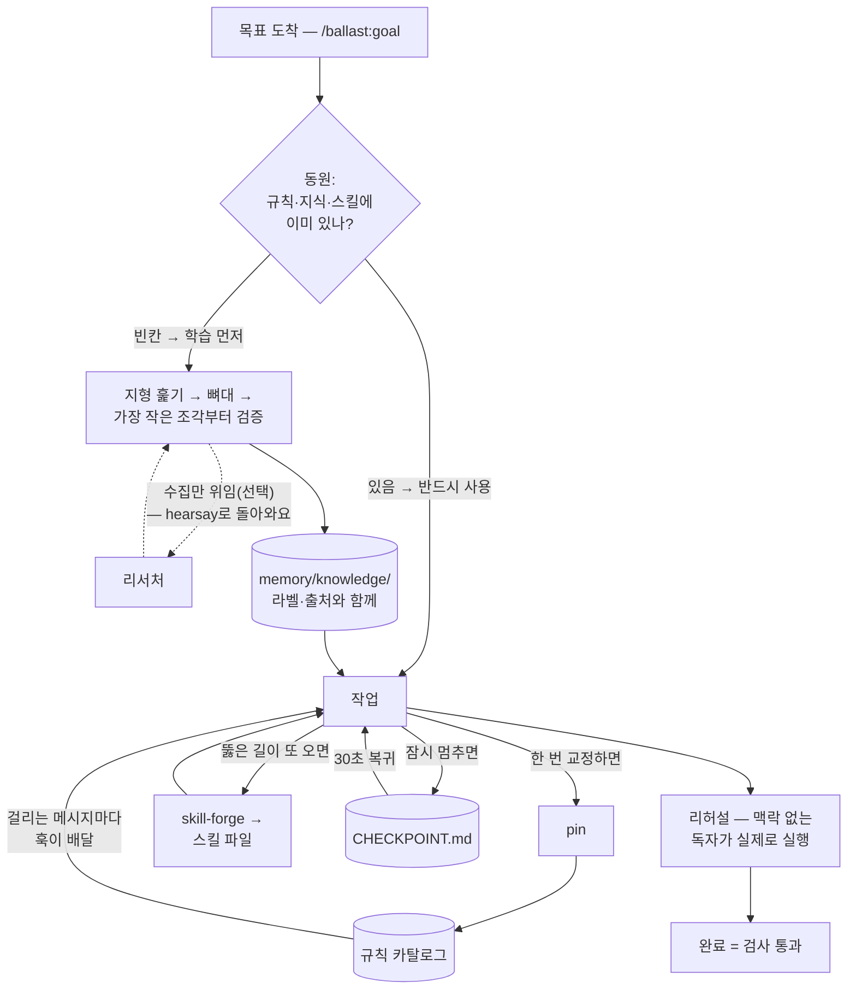

# ballast

**[English →](README.md)**


**ballast는 Claude와 하는 일 전체를 목표를 완성하는 시스템으로 만드는 플러그인이에요. 가진 것부터 동원하고, 배운 것은 쌓고, 한 번 뚫은 길은 다시 쓰고, 검사를 통과해야 완료라고 말해요 — 세션이 바뀌어도요.**

- **의존성 0, 네트워크 0** — 스크립트 하나, 임포트는 `fs`/`os`/`path`뿐이에요. ballast 자체는 아무것도 밖으로 안 보내요(선택으로 연결하는 verifier/researcher 명령은 사용자가 고른 로컬 CLI예요)
- **설치 명령 두 줄** — 플러그인 마켓플레이스로 끝나요
- **훅 1개 + 스킬 11종** — 코드로 강제되는 건 훅(메시지마다 자동으로 도는 스크립트) 하나뿐이고, 어느 조각이 코드고 어느 조각이 규약인지 표에 다 적어놨어요
- **사고가 나기 전에 검사가 먼저 돌아요** — 내보내기 전에 맥락 없는 독자가 결과물을 실제로 실행해 보고, 두 번째 모델이 수집해 온 조사는 사실이 아니라 `hearsay`(전언)로 도착해요
- **빈 채로 출발** — 카탈로그(규칙을 모아두는 파일)에 규칙이 들어오기 전까지 훅은 조용해요. 넣는 법은 [빠른 시작](#빠른-시작)이에요
- **[훅 실동작 5케이스 통과](hooks/scripts/verify-hook.mjs)** — 키워드 주입 · 미일치 침묵 · 차단 · 구버전 필드 호환 · 깨진 카탈로그 무해, 저장소를 클론하면 `node hooks/scripts/verify-hook.mjs`로 직접 재확인돼요
- **MIT** — 장치 전체가 한나절이면 다 읽히는 분량이에요

<p align="center">
  <a href="CHANGELOG.md"></a>
  <a href="LICENSE"></a>
</p>

<p align="center">
  <a href="#설치">설치</a> ·
  <a href="#왜-ballast인가">왜 ballast인가</a> ·
  <a href="#무엇이-달라지나">무엇이 달라지나</a> ·
  <a href="#구성-조각">구성 조각</a> ·
  <a href="#목표-하나-처음부터-끝까지">목표 하나</a> ·
  <a href="#빠른-시작">빠른 시작</a> ·
  <a href="#철학">철학</a> ·
  <a href="#유지보수">유지보수</a>
</p>

한 번 겪은 사고는 규칙이 돼요. 몇 주 전 npm이 락파일을 깨뜨렸을 때 규칙을 심어뒀다면, 오늘 세션은 이렇게 흘러가요:

```
> 설치 스크립트 하나 만들어줘 — npm install 하고 끝내자

[ballast] Standing rules that apply to this request:
- pnpm만 쓰기: 이 저장소는 pnpm 전용. npm install이 락파일을
  두 번 깨뜨렸다 — 스크립트와 명령은 pnpm으로.

Claude: pnpm으로 갈게요 — npm이 락파일을 두 번 깨뜨렸다는 규칙이
걸려 있어서요. 설치 스크립트는 pnpm install로 썼어요.
```

`[ballast]` 블록이 ballast가 보장하는 부분이에요. "npm"이 규칙에 걸려 본문 전체가 이 메시지와 함께 도착했고, 아래 답은 Claude가 기억해서가 아니라 건네받은 규칙을 따른 결과예요.

## 설치

```
/plugin marketplace add svy04/ballast
/plugin install ballast@ballast
```

훅은 PATH에 이미 있는 `node`(18 이상)로 돌아가요. 나머지는 전부 마크다운이에요. (설치 명령의 표기는 `플러그인@마켓플레이스`인데, 여기선 둘 다 이름이 ballast라 두 번 나와요.)

Codex를 쓰신다면 — 마켓플레이스는 없고, 짧은 수동 셋업(클론 + `AGENTS.md` 블록 하나 + 예시 카탈로그)으로 스킬 열한 개가 그대로 옮겨져요: [docs/CODEX.md](docs/CODEX.md)(영문). 훅만 Claude Code 전용이라, Codex에서는 전부 규약이에요.

## 왜 ballast인가

아래 표에서 *코드*는 스크립트가 강제한다는 뜻이고, *규약*은 Claude가 따르기로 한 마크다운 지침이라는 뜻이에요.

| 문제 | 증상 | 처방 |
|---|---|---|
| `CLAUDE.md`는 한 번 읽히고 끝 — 긴 세션은 멀어져요 | 같은 교정을 세션마다 반복 | **rules hook** *(코드)* — 걸린 규칙 본문을 메시지마다 배달 |
| 결정이 지난 대화 속에 묻혀요 | 끝난 논의가 다시 열리거나 슬쩍 고쳐짐 | **decision ledger**(결정 원장) *(규약)* — 덧붙이기만, 번복은 대체(supersede) 기록 |
| 그럴듯한 문장이 사실로 굳어요 | 검증 안 된 주장 위의 자신만만한 답 | **verify gate**(검증 관문) *(규약)* — 주장마다 라벨, `confirmed`(확인됨)는 얻어야 함 |
| 카피가 제품이 아니라 로드맵을 설명해요 | 없는 기능에 "우리는 X를 해요" | **proof standard**(증거 기준) *(규약)* — 대외 주장은 진실 파일에서만 |
| "완료"의 근거가 Claude의 말뿐이에요 | 선언된 성공, 조용한 실패 | **goal** *(규약)* — 완료 = 검사 통과 |
| 결과물이 독자를 처음 만나는 순간 무너져요 | 막힘과 오독이 배포 뒤에야 드러남 | **rehearsal**(리허설) *(규약)* — 맥락 없는 독자가 내보내기 전에 실제로 실행해요 |
| 수집과 판정이 한 몸으로 움직여요 | 두 번째 모델의 유창한 요약이 사실로 안착 | **researcher**(리서처) *(규약)* — 수집은 맡겨도 판정은 안 맡겨요, 결과는 `hearsay`로 도착 |

진실 파일(`memory/PRODUCT-TRUTH.md`)은 제품이 실제로 하는 일을 증거·날짜와 함께 적어둔 기록이에요. 검사 통과는 파일이 있고, 테스트가 돌고, 산출물을 실제로 봤다는 뜻이에요.

일곱 줄 중 코드로 강제되는 건 한 줄이에요. rules hook은 프롬프트마다 실행되는 스크립트라, Claude가 협조하든 말든 발동해요.

나머지 여섯은 규약이에요 — Claude가 따라 주는 만큼만 지켜지고, 여느 프롬프트처럼 흐려질 수 있어요. ballast는 이걸 아닌 척하지 않아요.

대신 규약을 강제로 끌어올리는 통로가 **pin**이에요. 규약이 미끄러지면 한 번만 교정하세요 — pin이 그 교정을 카탈로그에 적고, 그다음부터는 훅이 배달해요.

조각들은 목표의 한살이(시작부터 끝까지)를 따라 사슬로도 이어져요 — 이 사슬에서 코드는 훅 하나뿐이고, 나머지는 전부 규약이에요:

- **준비** — goal이 프로젝트가 이미 가진 것부터 동원하고, 그다음 지형을 살펴요 — 리서처를 연결해 두면 수집 자체를 맡길 수도 있어요
- **축적** — 일하면서 검증된 것을 knowledge-base(지식 창고)와 결정 원장에 쌓아요 — 결과물이 검사를 통과했다는 판정은 리허설이 만들어요
- **재사용** — rules hook · pin · skill-forge(스킬 대장간)가 쌓인 것을 다음 세션에 되돌려요
- **복귀** — checkpoint(복귀 지점)가 목표로 돌아오는 일을 30초 읽기로 만들어요



## 무엇이 달라지나

| 이전 | 이후 |
|---|---|
| 같은 교정을 매주 반복해요 | **pin**이 한 번 적어두면, 걸리는 메시지마다 같이 도착해요 |
| 상시 규칙이 관련 없어도 컨텍스트를 차지해요 | 걸린 규칙만 배달 — 규칙 12개 · 약 6,000자 상한 |
| 멈췄어야 할 프롬프트가 그냥 통과해요 | `action: "block"`이 거절하고, 그 규칙을 사유로 보여줘요 |
| 세션이 바뀌면 기억이 초기화돼요 | `memory/` 파일이 남아요: 인덱스, 원장, 미해결 질문, 세션 로그 |
| 목표의 뼈대가 세션과 함께 증발해요 | `memory/goal/<slug>.md`가 트리·빈칸·다음 잎을 지켜요 |

배달 상한은 훅 소스에 고정된 값이에요. 차단은 가드레일이지 샌드박스가 아니에요 — 훅이 못 돌면 차단도 꺼지는 fail-open이거든요(자세한 건 [빠른 시작](#빠른-시작)).

## 구성 조각

| 조각 | 종류 | 역할 |
|---|---|---|
| **rules hook** | 코드 — 프롬프트마다 도는 스크립트 | 걸린 규칙을 본문 그대로(상한까지) 메시지와 함께 배달, `block` 규칙은 프롬프트를 멈춰 세워요 |
| **decision-ledger** | 규약 — 마크다운 스킬 | 덧붙이기만 되는 `DECISIONS.md` — 번복은 대체 링크로, 조용한 수정은 없어요 |
| **verify-gate** | 규약 — 마크다운 스킬 | 반박을 견디고 출처를 대기 전까지, 조사 결과와 모델 지식은 초안 취급이에요 |
| **knowledge-base** | 규약 — 마크다운 스킬 | 관문을 통과한 발견을 `memory/knowledge/`에 쌓아요 — 새 질문은 조사 전에 먼저 여길 봐요 |
| **researcher** | 규약 — 마크다운 스킬 | 수집을 연결된 두 번째 CLI에 맡겨요 — 판정은 안 맡기고, 결과는 `hearsay`로 도착해 관문을 거쳐야 해요 |
| **proof-standard** | 규약 — 마크다운 스킬 | 진실 파일에 증거가 없으면 대외 주장 금지 — 카피가 코드 상태를 흐리면 안 돼요 |
| **brain-init** | 규약 — 마크다운 스킬 | 기억 골격을 깔아요: 인덱스, 원장, 미해결 질문, 세션 로그, 제품 진실 — 세션 시작 블록은 `CLAUDE.md`(Codex면 `AGENTS.md`)에 붙여요 |
| **goal** | 규약 — 마크다운 스킬 | 가진 것부터 동원하고, 함정을 지도로 그리고, 검증 가능한 크기로 쪼개고, 검사 통과 전엔 완료라 안 해요 |
| **rehearsal** | 규약 — 마크다운 스킬 | 내보내기 전에 맥락 없는 독자가 결과물을 실제로 실행해요 — 막힌 기록이 완료 판정의 증거가 돼요 |
| **checkpoint** | 규약 — 마크다운 스킬 | `CHECKPOINT.md`가 30초 복귀 지점을 지켜요 — `HANDOFF.md`(다음 세션에 주는 1회용 지시문)는 한 번 읽히면 바로 지워져요 |
| **pin** | 규약 — 훅이 강제할 규칙을 써요 | 방금 받은 교정을 한 번에 영구 규칙으로 바꿔요 |
| **skill-forge** | 규약 — 마크다운 스킬 | 또 올 일에서 검사까지 통과한 절차를 스킬 파일로 벼려요 — 다음엔 푼 길에서 시작해요 |

verify-gate의 라벨은 다섯 가지예요: `confirmed` / `observed`(관찰됨) / `assumed`(가정) / `hearsay`(전언) / `unknown`(모름). proof-standard는 코드를 4단계 — 구현됨 · 연결됨 · 가동 중 · 검증됨 — 로 추적해요.

모든 스킬은 `/ballast:<이름>`으로 직접 부를 수 있어요. 대부분은 자기 신호가 오면 알아서 발동하고, 언제 발동하는지는 각 스킬 파일 첫머리에 적혀 있어요.

## 목표 하나, 처음부터 끝까지

1. `/ballast:goal 가격 페이지 만들기` — 동원이 카탈로그의 가격 규칙과 `memory/knowledge/`의 브랜드 사실부터 찾아요. 둘 다 다시 조사하지 않고 그대로 써요.
2. 한 가지(결제 카피 관례)는 빈칸이에요. 지형 훑기부터 시작하고 — 리서처가 있으면 수집은 맡겨요, 전부 `hearsay`로 돌아와요 — 관문을 통과한 것만 `memory/knowledge/`에 쌓여요.
   뼈대는 `memory/goal/pricing-page.md`에 남아, 내일 세션이 같은 트리에서 시작해요.
3. 일하다 한 번 교정해요 — "가격은 부가세 포함으로." pin이 카탈로그에 적고, 그 뒤로는 가격 얘기가 나올 때마다 훅이 배달해요.
4. "페이지 올라갔고 폼 테스트됐어요"는 아직 주장이에요. 맥락 없는 독자가 그 페이지를 처음부터 걸어보고(리허설), 막힘 없이 통과한 그 기록이 완료를 만들어요.
5. 오늘은 여기까지 — checkpoint가 30초 복귀 지점을 적어둬요. 내일은 "어디까지 했더라"가 아니라 *다음 첫 동작*에서 시작해요.
6. 다음 분기의 가격 페이지는 뚫어둔 길에서 시작해요 — skill-forge가 그 절차를 스킬로 남겨뒀거든요.

교정 하나, 검증된 사실 하나, 뚫은 절차 하나 — 전부 세션보다 오래 살아요. 그게 이 플러그인의 전부예요.

## 빠른 시작

### 첫 세션

0. **60초 스모크 테스트.** `<프로젝트>/.claude/ballast.rules.json`을 예시 카탈로그([`rules/ballast.rules.example.json`](rules/ballast.rules.example.json))로 만들어 두세요.
   마켓플레이스로 설치했다면 Claude에게 "ballast 플러그인의 예시 카탈로그를 복사해줘"라고 하거나, 아래 [카탈로그를 직접 쓰세요](#카탈로그를-직접-쓰세요)의 JSON을 붙여 넣으면 돼요.
   그다음 "생성"이 들어간 메시지를 아무거나 보내 보세요 — 답 위에 `[ballast]` 블록이 뜨면 훅이 살아 있는 거예요.
1. **첫 규칙을 심으세요.** 아무 일에서든 Claude를 한 번 교정해 보세요 — 교정이 곧 **pin** 스킬의 신호라, Claude가 규칙 초안을 보여주고 OK 하면 카탈로그에 적어요. 초안이 안 뜨면 `/ballast:pin`을 직접 부르세요.
2. **`/ballast:brain-init`** — 프로젝트에 기억 파일의 골격을 깔아요. 이때 `CLAUDE.md`에 세션 시작 블록도 덧붙여요 — 그 파일이 바뀌는 게 정상이에요.
3. **`/ballast:goal <큰 목표>`** — 전체 파이프라인을 돌려요. 낯선 분야라면 답을 내놓기 전에 쟁점 · 정설 · 초심자 함정부터 지도로 그려요.

카탈로그가 비어 있으면 메시지에 아무것도 안 붙어요. 0단계의 예시 카탈로그가 깔려 있으면 "생성"이 `cost-gate` 규칙에 걸려, 메시지가 이렇게 도착해요:

```
> 이미지 40장 생성해줘

[ballast] Standing rules that apply to this request:
- Estimate before spending: Anything that spends money or credits:
  present an estimate and get explicit approval BEFORE executing.
  No exceptions for small amounts — the habit is the point.
```

### 카탈로그를 직접 쓰세요

규칙은 `<프로젝트>/.claude/ballast.rules.json`과 `~/.claude/ballast.rules.json`에 있어요(`id`가 겹치면 프로젝트 쪽이 이겨요). `version`/`rules` 껍데기까지가 파일 형식이에요 — 규칙 객체만 달랑 저장하면 소리 없이 0규칙으로 읽혀요:

```json
{
  "version": 1,
  "rules": [
    {
      "id": "cost-gate",
      "title": "Estimate before spending",
      "when": { "keywords": ["generate", "생성", "credits", "크레딧"], "patterns": ["\\bbatch\\b"] },
      "action": "inject",
      "body": "Anything that spends money or credits: present an estimate and get explicit approval BEFORE executing. No exceptions for small amounts — the habit is the point."
    }
  ]
}
```

- `keywords` — 대소문자 구분 없는 부분일치. 메시지에 그 문자열이 그대로 있어야 걸려요 — 한국어로 대화하면 위처럼 한국어 키워드를 병기하세요. 짧은 키워드는 긴 단어 속에서도 걸려요 — `npm`은 `pnpm`에도 발동해요
- `patterns` — 정규식
- `always: true` — 매 메시지 발동, 1~2개로 아껴 쓰세요
- `action: "block"` — 프롬프트를 세우고 `body`를 사유로 보여줘요
- `BALLAST_DISABLE=1` — 훅이 꺼져요 (환경변수는 Claude Code를 띄우는 환경에 설정해요)
- `BALLAST_DEBUG=1` — 카탈로그 로드 실패, 잘못된 정규식을 stderr로 보여줘요. 평소엔 훅이 삼키고 조용해요

시작은 [`rules/ballast.rules.example.json`](rules/ballast.rules.example.json)을 복사하거나, **pin**에게 맡기세요.

### 한계를 알고 쓰세요

설계상 미리 알아둘 것이 두 가지예요:

- **조용한 실패** — 카탈로그가 망가져도, 정규식이 틀려도, 내부 오류가 나도 세션은 안 깨져요.
- **fail-open** — 훅이 아예 못 도는 상황(PATH에 `node` 없음, 카탈로그 읽기 실패)에서는 `block` 규칙도 같이 안 걸려요. 차단은 가드레일로 쓰시고, 뚫리지 않는 샌드박스로 믿지는 마세요.

fail-open엔 오류 화면이 없어요 — 걸렸어야 할 메시지에 `[ballast]` 블록이 안 뜨는 게 유일한 증상이에요.
`node --version`이 18 이상인지 확인하고(없으면 Node부터 설치), 방금 설치했다면 Claude Code를 재시작한 뒤, `BALLAST_DEBUG=1`로 다시 돌려 원인을 보세요.

검증에 두 번째 모델을 세우고 싶으면 `<프로젝트>/.claude/ballast.verifier.json`을 만드세요 — 파일 전체가 `{ "command": "your-verifier-cli --check" }` 한 줄이에요([예시](rules/ballast.verifier.example.json)).

`command`에 주장을 반박해 줄 CLI를 지정하면, verify-gate 스킬이 주장을 마지막 인자로 붙여 실행하고 반박을 견줘본 뒤에야 `confirmed`를 붙여요.

파일이 없거나 명령이 죽어 있으면(한 번 말하고) 관문은 직접 연 1차 출처만으로 돌고, 라벨 옆에 `(self-gated)`를 병기해요.

수집도 같은 방식이에요 — `<프로젝트>/.claude/ballast.researcher.json`에 `{ "command": "your-researcher-cli --search" }`를 넣으세요([예시](rules/ballast.researcher.example.json)).
researcher 스킬이 질문을 마지막 인자로 붙여 실행해요.

수집은 맡겨도 판정은 안 맡겨요 — 결과는 `hearsay`로 도착해 관문을 거쳐야 해요. 파일이 없으면 지금처럼 Claude가 직접 수집하고, 명령이 죽어 있으면 한 번 말한 뒤 직접 수집으로 바꿔요.

Claude가 굴려온 저장소에서 처음 푸시하기 전에는 [docs/PUBLISH-CHECKLIST.md](docs/PUBLISH-CHECKLIST.md)(영문)를 한 줄씩 밟으세요 — 이런 작업 공간에는 어느새 안 들여다보게 된 파일들에 비밀값이 쌓여요.

## 철학

ballast의 전제는 이래요: Claude와의 일이 어긋날 때 보통의 원인은 능력 부족이 아니라 기억과 과신이에요. 그래서 규칙은 파일에 두고, 필요한 메시지와 함께 도착하게 해요.

결정은 조용히 고쳐 쓸 수 없는 원장에 남겨요. 주장은 `confirmed`를 얻기 전까지 라벨을 달고 다녀요.

조각들의 배치 원리는 하나예요 — 사고가 나기 전에 검사가 먼저 돌아요. 규칙은 답보다 먼저 도착하고, 동원(가진 것부터 꺼내 쓰기)은 작업보다 먼저 돌고, 리허설은 독자가 결과물을 만나기 전에 돌아요.

이 순서는 사고를 배포한 뒤에 고치던 몇 달에서 나왔어요 — 바로 아래에서 `hearsay`로 밝혀 두는 그 몇 달이에요. ballast는 같은 사고가 생길 자리를 좁히도록 짜여 있어요.

그 라벨 기준으로, 이 README가 밝혀둘 것이 두 가지 있어요:

- **실적은 `hearsay`예요.** 개발 배경 없는 한 사람이 업무 전체를 Claude Code로 돌리며 그 결과를 믿어야 했던 게 ballast의 출발이에요. 하지만 그 몇 달의 일상 사용은 비공개 회사 작업 공간에서 있었고, 이 공개 저장소는 2026년 8월에 시작됐어요 — 열어볼 수 있는 이력이 여기엔 없어요.
- **새로움 주장은 `unknown`이에요.** 프롬프트 제출 시점의 컨텍스트 주입은 문서화된 Claude Code 훅 패턴이고, 덧붙이기만 하는 기록은 소프트웨어보다 오래된 방식이에요. ballast가 말할 수 있는 최대치는 "이 루프 전체를 묶어놓은 걸 다른 데서는 못 봤다"까지예요.

대신 장치는 확인할 수 있어요 — 훅, 스킬 열한 개, 규칙 형식이 전부 이 저장소에 있고, 한나절이면 다 읽혀요. 루프의 선례를 아시면 [이슈](https://github.com/svy04/ballast/issues)로 알려주세요. 링크해 둘게요.

## 유지보수

버전 이력은 [CHANGELOG.md](CHANGELOG.md)(영문)에 있어요 — 릴리스마다 무엇이 바뀌고 무엇이 정정됐는지 적어요. [이슈](https://github.com/svy04/ballast/issues)로 물으면 문서에 반영해요 — README에 있었어야 할 답은 README에 적어둘게요.

PR은 [CONTRIBUTING.md](CONTRIBUTING.md)(영문)에서 출발하세요 — 요지는 두 줄이에요: 훅은 의존성 0에 조용한 실패를 지키고, 문서는 동작과 어긋나면 안 돼요.

---

MIT
