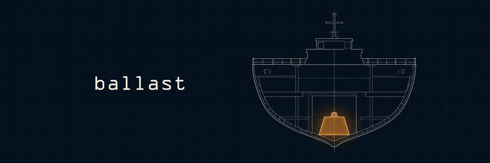
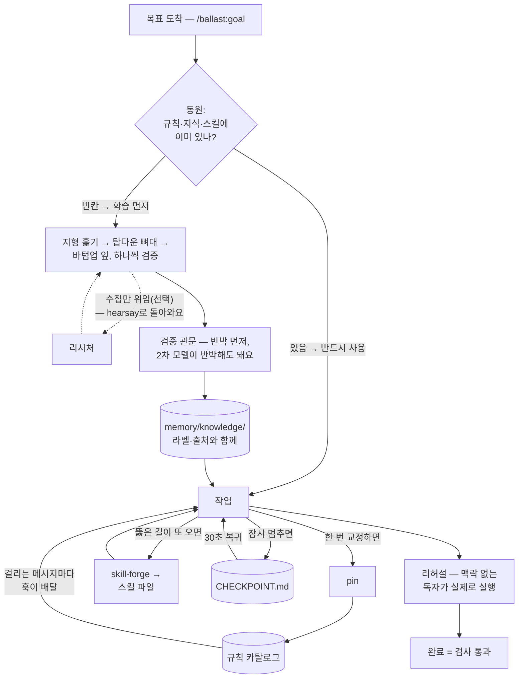

# ballast

**[English →](README.md) · [简体中文 →](README.zh-CN.md)**



**ballast는 전문성이 없는 분야의 목표도 기반부터 쌓아 올려 끝까지 끌고 가고, 한 번 뚫은 길을 남겨 다음 목표가 더 앞에서 시작하게 하는 Claude Code 플러그인이에요.**

Claude와 몇 주 일하다 보면 이런 게 쌓여요.

- **같은 교정을 다음 달에 또 한다**
- **끝난 결정이 다시 열리거나 조용히 바뀐다**
- **출처 없는 답을 믿었다가 나중에 안다**
- **홍보 문구가 아직 없는 기능을 있다고 쓴다**
- **"다 됐다"의 근거가 Claude 말뿐이다**
- **내보낸 결과물이 첫 독자에게서 막힌다**
- **다른 AI가 정리해 준 게 사실로 앉는다**
- **이미 적어둔 걸 못 찾고 또 조사한다**

여덟 줄의 원인은 하나예요 — 무게가 전부 대화 안에만 실려 있다는 것. 배는 이걸 밑바닥에 무게를 실어서 잡고, 그 무게를 ballast라고 불러요. 여기서는 규칙과 결정과 검증된 사실이 그 밑짐이에요 — 파일에 실려서 대화 밑을 받쳐요.

그리고 밑짐은 쌓여요. 헤매다 겨우 찾은 방법, 확인을 통과한 사실, 막연하고 큰 문제를 잘게 쪼갠 결과 — 그게 그대로 남아서 다음 목표는 그 위에서 시작해요. 같은 길을 두 번 파지 않아요.

그중 가장 작은 조각이 실제 세션에서 도는 장면이에요 — 목록 첫 줄의 증상을, 몇 주 전에 한 번 심어둔 규칙이 막아요:

```
> 설치 스크립트 하나 만들어줘 — npm install 하고 끝내자

[ballast] Standing rules that apply to this request:
- pnpm만 쓰기: 이 저장소는 pnpm 전용. npm install이 락파일을
  두 번 깨뜨렸다 — 스크립트와 명령은 pnpm으로.

Claude: pnpm으로 갈게요 — npm이 락파일을 두 번 깨뜨렸다는 규칙이
걸려 있어서요. 설치 스크립트는 pnpm install로 썼어요.
```

`[ballast]` 블록이 ballast가 보장하는 부분이에요. "npm"이 규칙에 걸려 규칙 본문 전체가 이 메시지와 함께 도착했어요. 아래 답 줄은 예시예요 — 훅이 보장하는 건 배달이지 복종이 아니에요.

## 설치

```
/plugin marketplace add svy04/ballast
/plugin install ballast@ballast
```

Claude Code(터미널·IDE에서 쓰는 Claude 에이전트)에서 위 두 줄이면 끝나요. 훅은 PATH에 이미 있는 `node`(18 이상)로 돌아가고, 나머지 열두 조각은 마크다운 스킬이에요. (설치 명령의 표기는 `플러그인@마켓플레이스`인데, 여긴 둘 다 이름이 ballast라 두 번 나와요.)

Codex를 쓰신다면 — 같은 저장소가 Codex 플러그인으로도 설치돼요: `codex plugin marketplace add svy04/ballast` 다음 `codex plugin add ballast@ballast`.
같은 훅이 거기서도 돌아요 — Codex가 `hooks/hooks.json`을 읽고, `/hooks`에서 한 번 신뢰하면 켜져요.
플러그인 없이도 프로젝트의 `.codex/hooks.json` 하나면 같은 일을 하고, 훅이 없는 빌드를 위해 `codex exec` 래퍼도 남겨 뒀어요: [docs/CODEX.md](docs/CODEX.md)(영문).

<p align="center">
  <a href="CHANGELOG.md"></a>
  <a href="LICENSE"></a>
</p>

<p align="center">
  <a href="#어떻게-돌아가나">어떻게 돌아가나</a> ·
  <a href="#구성-조각">구성 조각</a> ·
  <a href="#빠른-시작">빠른 시작</a> ·
  <a href="#철학">철학</a>
</p>

<details>
<summary><strong>사양</strong> — 의존성, 강제되는 범위, 빈 채로 출발</summary>

- **의존성 0, 네트워크 0** — 훅은 스크립트 하나고, 임포트는 `fs`/`os`/`path`뿐이에요. ballast 자체는 아무것도 밖으로 안 보내요
  (선택으로 연결하는 verifier/researcher 명령은 사용자가 고른 로컬 CLI고, 검사용 verify 스크립트는 별개라 `node`를 띄워 훅만 다시 돌려요)
- **훅 1개 + 스킬 12종** — 코드로 강제되는 건 훅 하나뿐이고, 어느 조각이 코드고 어느 조각이 규약인지 표에 다 적어놨어요
- **빈 채로 출발하되, 그렇다고 말해요** — 세션이 열릴 때마다 한 줄이 떠요: `[ballast] hook live — 규칙 N개 로드`, 처음엔 0개. 메시지에는 규칙이 걸리기 전까지 조용해요. 넣는 법은 [빠른 시작](#빠른-시작)이에요.
  상주 비용: 스킬 설명 열두 개가 영어로 약 490단어이고, 스킬 본문은 부를 때만 실려요
- **[훅 실동작 10케이스 통과](hooks/scripts/verify-hook.mjs)** — 키워드 주입 · 미일치 침묵 · 차단 · 구버전 필드 호환 · 깨진 카탈로그는 그렇다고 알림 · 그래도 세션은 안 막음 · 훅 선언 파일 모양 · 시작 줄(규칙 있을 때·카탈로그 없을 때·깨졌을 때).
  검사는 훅이 무엇을 내보내는지를 보지, 모델이 따르는지는 안 봐요.
  저장소를 클론하면 `node hooks/scripts/verify-hook.mjs`로 직접 재확인돼요
- **MIT** — 장치 전체가 한나절이면 다 읽히는 분량이에요

</details>

## 어떻게 돌아가나

큰 걸 하나 맡겨 보세요 — `/ballast:goal 가격 페이지 만들기`. 조각 전부가 그 목표 하나에 순서대로 붙어요.

**시작은 이미 가진 것부터예요.** 세션 첫 답변에서 recall 스킬이 brain-init이 첫날 깔아둔 파일들을 훑어둬요 — 인덱스·지식·결정·규칙·스킬 다섯 곳을 다 보고, 처음 걸린 것에서 멈추지 않아요.
goal 스킬은 목표를 가지로 쪼갠 뒤, 가지마다 그 목록과 대조해요.

있는 가지는 그 파일을 반드시 써요. 카탈로그에 있던 가격 규칙과 `memory/knowledge/`의 브랜드 사실은 그대로 꺼내 써요 — 이미 가진 걸 또 조사하는 게 이 단계가 막는 사고예요. 빈 가지는 학습이 첫 일이 돼요.

**빈 가지는 답이 아니라 질문부터 시작해요.** 처음 보는 분야에서는 "뭐가 중요한지"에 대한 감이 가장 못 믿을 물건이거든요.
그래서 지형부터 훑어요 — 쟁점, 정설, 초심자가 데이는 곳을 지도로 모아요.

그다음 그 가지를 위에서부터 원자 단위 피라미드로 쪼개요. 겹침도 빠짐도 없이, 잎 하나가 혼자 검증될 만큼 작아질 때까지요.
일하다 드러난 하위 분야는 그 순간 이름부터 등록해요. 안 채운 잎은 있어도, 이름 없는 잎은 없어요.

**잎은 아래에서부터 채우고, 검증 없이는 무게를 싣지 않아요.** 수집은 두 번째 CLI(리서처)에 맡길 수 있어요 — 찾아오는 건 잘해도 믿을지는 못 정하니까, 결과는 `hearsay`(전언)로 도착해요.
잎마다 검증 관문을 거쳐요 — 반박 먼저, 출처, 라벨 — 살아남은 것만 `memory/knowledge/`에 쌓여요.

뼈대 자체는 `memory/goal/pricing-page.md`에 살아요: 트리, 빈칸, 다음 잎. 내일 세션은 그 파일에서 이어서 시작해요.

**작업은 준비된 땅 위에서 돌아요.** 품질은 뒤에서 고치는 게 아니라 앞에서 정해져요.
일하다 한 번 교정하면 — "가격은 부가세 포함으로" — pin이 카탈로그에 적고, 그 뒤로는 규칙에 걸리는 메시지마다, 걸리는 메시지에만 훅이 배달해요. 상시 규칙은 자기 키워드가 나타난 순간에만 따라와요.

제품에 대해 밖에 하는 말은 proof-standard를 먼저 거쳐요. 대외 주장은 진실 파일 — 실제로 되는 것을 증거와 함께 적은 기록 — 에서만 나와요. 기록에 없으면 그 말은 안 해요.

**완료도 주장이라, 완료도 검사를 통과해야 해요.** 맥락 없는 독자가 결과물을 처음부터 직접 따라가 보고(리허설), 막힌 곳 없는 라운드가 나와야 검사가 통과돼요 — 그 라운드의 기록이 증거예요.
검사 통과란 파일이 있고, 테스트가 돌고, 산출물을 실제로 봤다는 뜻이에요.

목표가 푼 것은 그대로 남아요. 결정은 원장에 — 바뀌면 대체 기록으로만, 그리고 실제로 말한 것만 들어가요. 침묵을 읽은 해석은 미해결 질문에 남아요. 또 올 절차는 스킬이 되고(skill-forge), 멈춘 자리는 30초 복귀 지점이 돼요(checkpoint). 다음 분기의 가격 페이지는 뚫어둔 길 위에서 출발해요.

같은 루프를 그림으로 — 네모는 조각이고, 원통은 세션이 끝나도 남는 파일이에요:



이 전부에서 코드는 훅 하나예요 — 프롬프트마다 도는 스크립트라, Claude가 협조하든 말든 발동해요. 열두 스킬은 규약이에요 — Claude가 따라 주는 만큼만 지켜지는 마크다운 지침이요.
그리고 규약은 흐려져요. `CLAUDE.md`가 한 번 읽히고 일이 진행될수록 멀어지듯, 규약도 같은 방식으로 멀어질 수 있어요.

ballast는 이걸 아닌 척하지 않아요. 대신 규약을 강제로 끌어올리는 통로가 **pin**이에요 — 규약이 미끄러지면 한 번만 교정하세요. pin이 그 교정을 카탈로그에 적고, 그다음부터는 훅이 배달해요.

## 구성 조각

| 조각 | 종류 | 역할 |
|---|---|---|
| **rules hook** | 코드 — 프롬프트마다 도는 스크립트 | 걸린 규칙을 본문 그대로 메시지와 함께 배달 — 한 번에 최대 규칙 12개 · 약 6,000자(소스에 고정된 상한). `block` 규칙은 프롬프트를 멈추고 그 규칙을 사유로 보여줘요 |
| **decision-ledger** | 규약 — 마크다운 스킬 | 덧붙이기만 되는 `DECISIONS.md` — 번복은 대체(supersede) 링크로, 조용한 수정은 없어요. 무응답은 결정이 아니라서, 확인 안 된 해석은 `assumed` 표시로 미해결 질문에 남아요 |
| **verify-gate** | 규약 — 마크다운 스킬 | 반박을 견디고 출처를 대기 전까지, 조사 결과와 모델 지식은 초안 취급이에요 |
| **knowledge-base** | 규약 — 마크다운 스킬 | 관문을 통과한 발견을 `memory/knowledge/`에 쌓아요 — 새 질문은 조사 전에 먼저 여길 봐요 |
| **researcher** | 규약 — 마크다운 스킬 | 수집을 연결된 두 번째 CLI에 넘겨요 — 결과는 `hearsay`로 도착해 관문을 거쳐요 |
| **proof-standard** | 규약 — 마크다운 스킬 | 진실 파일에 증거가 없으면 대외 주장 금지 — 카피가 코드 상태를 흐리면 안 돼요 |
| **brain-init** | 규약 — 마크다운 스킬 | 기억 골격을 깔아요: 인덱스, 원장, 미해결 질문, 세션 로그, 제품 진실 — 세션 시작 블록은 `CLAUDE.md`(Codex면 `AGENTS.md`)에 붙여요 |
| **goal** | 규약 — 마크다운 스킬 | 가진 것부터 동원하고, 목표를 위에서부터 겹침도 빠짐도 없이 원자 단위 피라미드로 쪼갠 뒤, 빈칸을 아래에서부터 검증해 가며 채워요 — 뼈대는 `memory/goal/<slug>.md`에 남아요 |
| **rehearsal** | 규약 — 마크다운 스킬 | 내보내기 전에 맥락 없는 독자가 결과물을 실제로 실행해요 — 라운드 기록이 완료 판정의 증거가 돼요 |
| **checkpoint** | 규약 — 마크다운 스킬 | `CHECKPOINT.md`가 30초 복귀 지점을 지켜요 — `HANDOFF.md`(다음 세션에 주는 1회용 지시문)는 한 번 읽히면 바로 지워져요 |
| **pin** | 규약 — 마크다운 스킬 | 방금 받은 교정을 훅의 카탈로그에 영구 규칙으로 적어요 — 한 번에요 |
| **recall** | 규약 — 마크다운 스킬 | 세션 첫 답변과 주제가 바뀌는 순간, 답하기 전에 인덱스·지식·결정·규칙·스킬 다섯 곳을 훑어요 — 첫 히트에서 안 멈춰요 |
| **skill-forge** | 규약 — 마크다운 스킬 | 또 올 일에서 검사까지 통과한 절차를 스킬 파일로 벼려요 — 다음엔 푼 길에서 시작해요 |

verify-gate의 라벨은 다섯 가지예요: `confirmed`(확인됨) / `observed`(관찰됨) / `assumed`(가정) / `hearsay`(전언) / `unknown`(모름). proof-standard는 코드를 4단계 — 구현됨 · 연결됨 · 가동 중 · 검증됨 — 로 추적해요.

레퍼런스: [skills/](skills/) — 각 스킬 파일 첫머리에 언제 발동하는지 적혀 있어요. 모든 스킬은 `/ballast:<이름>`으로 직접 부를 수도 있어요.

## 빠른 시작

### 첫 세션

0. **60초 스모크 테스트(설치 확인).** `<프로젝트>/.claude/ballast.rules.json`을 예시 카탈로그([`rules/ballast.rules.example.json`](rules/ballast.rules.example.json))로 만들어 두세요.
   마켓플레이스로 설치했다면 Claude에게 "ballast 플러그인의 예시 카탈로그를 복사해줘"라고 하거나, 아래 [카탈로그를 직접 쓰세요](#카탈로그를-직접-쓰세요)의 JSON을 붙여 넣으면 돼요.
   그다음 "생성"이 들어간 메시지를 아무거나 보내 보세요 — 답 위에 `[ballast]` 블록이 뜨면 훅이 살아 있는 거예요.
1. **첫 규칙을 심으세요.** 아무 일에서든 Claude를 한 번 교정해 보세요 — 교정이 곧 **pin** 스킬의 신호라, Claude가 규칙 초안을 보여주고 OK 하면 카탈로그에 적어요. 초안이 안 뜨면 `/ballast:pin`을 직접 부르세요.
2. **`/ballast:brain-init`** — 프로젝트에 기억 파일의 골격을 깔아요: 인덱스, 원장, 미해결 질문, 세션 로그, 제품 진실. 이때 `CLAUDE.md`에 세션 시작 블록도 덧붙여요 — 그 파일이 바뀌는 게 정상이에요.
3. **`/ballast:goal <큰 목표>`** — 전체 파이프라인을 돌려요. 낯선 분야라면 답을 내놓기 전에 쟁점 · 정설 · 초심자 함정부터 지도로 그려요.

카탈로그가 비어 있으면 메시지에 아무것도 안 붙어요. 0단계의 예시 카탈로그가 깔려 있으면 "생성"이 `cost-gate` 규칙에 걸려, 메시지가 이렇게 도착해요:

```
> 이미지 40장 생성해줘

[ballast] Standing rules that apply to this request:
- Estimate before spending: Anything that spends money or credits:
  present an estimate and get explicit approval BEFORE executing.
  No exceptions for small amounts — the habit is the point.
```

### 카탈로그를 직접 쓰세요

규칙은 `<프로젝트>/.claude/ballast.rules.json`과 `~/.claude/ballast.rules.json`에 있어요(`id`가 겹치면 프로젝트 쪽이 이겨요). `version`/`rules` 껍데기까지가 파일 형식이에요 — 규칙 객체만 달랑 저장하면 소리 없이 0규칙으로 읽혀요:

```json
{
  "version": 1,
  "rules": [
    {
      "id": "cost-gate",
      "title": "Estimate before spending",
      "when": { "keywords": ["generate", "생성", "credits", "크레딧"], "patterns": ["\\bbatch\\b"] },
      "action": "inject",
      "body": "Anything that spends money or credits: present an estimate and get explicit approval BEFORE executing. No exceptions for small amounts — the habit is the point."
    }
  ]
}
```

- `keywords` — 대소문자 구분 없는 부분일치. 메시지에 그 문자열이 그대로 있어야 걸려요 — 한국어로 대화하면 위처럼 한국어 키워드를 병기하세요(규칙 본문도 원하는 언어로 쓰면 돼요).
  짧은 키워드는 긴 단어 속에서도 걸려요 — `npm`은 `pnpm`에도 발동해요
- `patterns` — 정규식(패턴 매칭 문법 — 모르면 안 써도 돼요, `keywords`로 충분해요)
- `always: true` — 매 메시지 발동, 1~2개로 아껴 쓰세요
- `action: "block"` — 프롬프트를 세우고 `body`를 사유로 보여줘요
- `BALLAST_DISABLE=1` — 훅이 꺼져요 (환경변수는 Claude Code를 띄우는 환경에 설정해요)
- `BALLAST_DEBUG=1` — 카탈로그 로드 실패, 잘못된 정규식을 stderr로 보여줘요. 평소엔 훅이 삼키고 조용해요

시작은 [`rules/ballast.rules.example.json`](rules/ballast.rules.example.json)을 복사하거나, **pin**에게 맡기세요.

### 한계를 알고 쓰세요

설계상 미리 알아둘 것이 세 가지예요:

- **조용한 실패, 예외 둘** — 정규식이 틀려도 내부 오류가 나도 세션은 안 깨지고 아무 말도 안 해요. 예외 하나는 카탈로그가 있는데 안 읽히는 경우 — 이때 한 줄로 알려줘요. 안 그러면 규칙이 통째로 빠진 상태와 그냥 안 걸린 상태가 똑같아 보이거든요.
  또 하나는 세션 시작마다 뜨는 상태 한 줄이에요 — 죽은 훅도 조용한 훅과 똑같아 보이니까요.
- **fail-open** — 훅이 아예 못 도는 상황(PATH에 `node` 없음, 카탈로그 읽기 실패)에서는 `block` 규칙도 같이 안 걸려요. 차단은 가드레일로 쓰시고, 뚫리지 않는 샌드박스로 믿지는 마세요.
- **설치하면 눈에 보이는 게 하나 생겨요** — 세션 시작의 한 줄(`[ballast] hook live — 아직 카탈로그 없음`, 규칙이 들어올 때까지).
  나머지는 신호가 와야 깨어나요: 교정하면 pin이, 세션 첫 답변이면 recall이 깨어나요(`/ballast:brain-init` 전에는 recall이 훑을 기억 파일 자체가 없어요).
  프로젝트 카탈로그는 저장소를 따라와요 — 남의 저장소를 클론하면 그 `.claude/ballast.rules.json`은 남의 상주 지시예요. 시작 줄이 규칙 수와 always 규칙 수를 세어 주니, 낯선 저장소를 열 땐 그 줄을 읽으세요.
  `BALLAST_DISABLE=1`은 훅을 끄고 `BALLAST_QUIET=1`은 상태 줄만 꺼요. 스킬은 플러그인을 지우면 같이 나가요.

fail-open엔 오류 화면이 없어요 — 증상은 둘이에요: 세션 시작에 `[ballast] hook live` 줄이 안 뜨거나, 걸렸어야 할 메시지에 `[ballast]` 블록이 안 뜨는 것. 둘 중 하나가 보이면 셋을 순서대로 확인하세요.

1. `node --version`이 18 이상인지 확인하세요 — 없으면 Node부터 설치하고요
2. 방금 설치했다면 Claude Code를 재시작하세요
3. `BALLAST_DEBUG=1`로 다시 돌려 원인을 보세요

Claude가 굴려온 저장소를 처음 공개(푸시)하기 전에는 [docs/PUBLISH-CHECKLIST.md](docs/PUBLISH-CHECKLIST.md)(영문)를 한 줄씩 밟으세요 — 이런 작업 공간에는 어느새 안 들여다보게 된 파일들에 비밀값이 쌓여요.

<details>
<summary><b>선택 — 검증·수집에 두 번째 모델 세우기</b></summary>

검증에 두 번째 모델을 세우고 싶으면 `<프로젝트>/.claude/ballast.verifier.json`을 만드세요 — 파일 전체가 `{ "command": "your-verifier-cli --check" }` 한 줄이에요([예시](rules/ballast.verifier.example.json)).

`command`에 주장을 반박해 줄 CLI를 지정하면, verify-gate 스킬이 주장을 마지막 인자로 붙여 실행하고 반박을 견줘본 뒤에야 `confirmed`를 붙여요.

파일이 없거나 명령이 죽어 있으면(실패는 한 번만 알려요) 관문은 직접 열어 본 1차 출처만으로 돌고, 라벨 옆에 `(self-gated)`를 병기해요.

수집도 같은 방식이에요 — `<프로젝트>/.claude/ballast.researcher.json`에 `{ "command": "your-researcher-cli --search" }`를 넣으세요([예시](rules/ballast.researcher.example.json)).
researcher 스킬이 질문을 마지막 인자로 붙여 실행해요.

수집은 맡겨도 판정은 안 맡겨요 — 결과는 `hearsay`로 도착해 관문을 거쳐야 해요. 파일이 없으면 지금처럼 Claude가 직접 수집하고, 죽은 명령은 한 번만 알린 뒤 직접 수집으로 바꿔요.

</details>

## 철학

ballast는 평범한 상황에서 출발해요. 개발 배경 없는 한 사람이 배운 적 없는 분야들을 오가며 업무 전체를 Claude Code로 돌려요. 그걸 버티게 하는 건 미리 더 많이 아는 게 아니라, 목표마다 거기 필요한 기반부터 쌓아 올리고 한 번 푼 길을 남겨 다음 목표가 더 앞에서 시작하게 하는 거예요.

그걸 무너뜨리는 게 기억과 과신이에요. 그래서 규칙은 파일에 두고, 필요한 메시지와 함께 도착하게 해요.

결정은 조용히 고쳐 쓸 수 없는 원장에 남겨요. 주장은 `confirmed`를 얻기 전까지 라벨을 달고 다녀요.

조각들의 배치 원리는 하나예요 — 사고가 나기 전에 검사가 먼저 돌아요. 이 순서는 사고를 내보낸 뒤에야 고치던 몇 달에서 나왔어요 — 바로 아래에서 `hearsay`로 밝혀 두는 그 몇 달이에요. ballast는 같은 사고가 생길 자리를 좁히도록 짜여 있어요.

그 라벨 기준으로, 이 README가 밝혀둘 것이 두 가지 있어요:

- **실적은 `hearsay`예요.** 그 몇 달의 일상 사용은 비공개 회사 작업 공간에서 있었고, 이 공개 저장소는 2026년 8월에 시작됐어요 — 열어볼 수 있는 이력이 여기엔 없어요.
- **새로움 주장은 `unknown`이에요.** 프롬프트 제출 시점의 컨텍스트 주입은 문서화된 Claude Code 훅 패턴이고, 덧붙이기만 하는 기록은 소프트웨어보다 오래된 방식이에요. ballast가 말할 수 있는 최대치는 "이 루프 전체를 묶어놓은 걸 다른 데서는 못 봤다"까지예요.

대신 장치는 확인할 수 있어요 — 훅, 스킬 열두 개, 규칙 형식이 전부 이 저장소에 있어요. 루프의 선례를 아시면 [이슈](https://github.com/svy04/ballast/issues)로 알려주세요. 링크해 둘게요.

## 유지보수

버전 이력은 [CHANGELOG.md](CHANGELOG.md)(영문)에 있어요 — 릴리스마다 무엇이 바뀌고 무엇이 정정됐는지 적어요. [이슈](https://github.com/svy04/ballast/issues)로 물으면 문서에 반영해요 — README에 있었어야 할 답은 README에 적어둘게요.

PR(수정 제안)은 [CONTRIBUTING.md](CONTRIBUTING.md)(영문)에서 출발하세요 — 요지는 두 줄이에요: 훅은 의존성 0에 조용한 실패를 지키고, 문서는 동작과 어긋나면 안 돼요.

---

MIT
