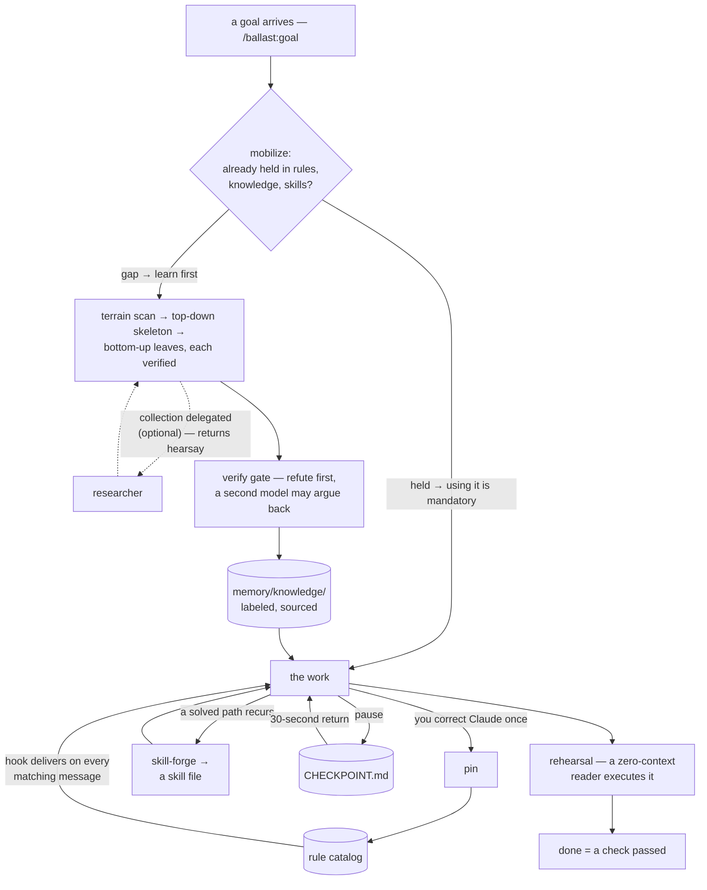

# ballast

**[한국어 문서 →](README.ko.md) · [简体中文 →](README.zh-CN.md)**


A few weeks into working with Claude, this piles up:

- **You give the same correction again next month** — the rule arrives with the message it fits
- **A settled decision reopens, or quietly changes** — decisions are added, never edited over
- **You act on an unsourced answer, and find out later** — a claim must survive refutation first
- **Your copy names a feature nobody built yet** — outside claims come from an evidence file
- **"Done" turns out to mean Claude said so** — done means a check actually passed
- **What you shipped stalls its first reader** — someone who knows nothing runs it first
- **Another model's tidy summary lands as fact** — it can fetch, but it cannot rule
- **You re-research what the project already wrote down** — everything held is swept before the answer

All eight have one thing in common: the weight sits in the conversation and nowhere else.

A ship rolls the same way when its cargo rides light. So crews load weight low in the hull, under everything else. That weight is called ballast.

**This is the plugin that loads it into your work with Claude. Rules, decisions, and verified facts live in files, so a goal in a field you have never worked in can be built up from the foundations it needs and carried through.**

And ballast accumulates. A method you only found after dead ends, a fact that survived checking, a vague problem finally cut into pieces — each one stays, and the next goal starts on top of it. You do not dig the same hole twice.

Here is that first line, in a session. You set the rule once, weeks ago:

```
> add a setup script — npm install and we're done

[ballast] Standing rules that apply to this request:
- Use pnpm here: This repo uses pnpm. npm install has broken the
  lockfile twice; write scripts and commands with pnpm.

Claude: Using pnpm — your rule says npm broke the lockfile twice.
The setup script runs pnpm install.
```

The `[ballast]` block is the guaranteed part: "npm" matched your rule, so its full text arrived with this message. The reply follows what Claude was handed, not what it remembered.

## Install

```
/plugin marketplace add svy04/ballast
/plugin install ballast@ballast
```

Two lines in Claude Code and you are done. The hook runs on the `node` (≥ 18) already on your PATH; everything else is markdown. (The install id reads `plugin@marketplace` — both happen to be named ballast here.)

Using Codex instead? No marketplace there — a short manual setup (clone + one `AGENTS.md` block + the example catalog) carries the twelve skills over: [docs/CODEX.md](docs/CODEX.md). Only the hook stays Claude Code-specific, so on Codex everything is convention.

<p align="center">
  <a href="CHANGELOG.md"></a>
  <a href="LICENSE"></a>
</p>

<p align="center">
  <a href="#why-ballast">Why</a> ·
  <a href="#the-pieces">Pieces</a> ·
  <a href="#one-goal-start-to-finish">One goal</a> ·
  <a href="#quick-start">Quick start</a> ·
  <a href="#philosophy">Philosophy</a>
</p>

<details>
<summary><strong>Specs</strong> — dependencies, what is enforced, what ships empty</summary>

- **Zero dependencies, zero network** — the hook is one script, imports only `fs`/`os`/`path`; it reads local files and prints. ballast itself sends nothing anywhere (the optional verifier/researcher commands are local CLIs you configure, and the separate check harness only spawns `node` to re-run the hook)
- **One hook + twelve skills** — only the hook is code-enforced, and the docs label which is which
- **Ships empty** — the hook stays silent until rules enter your catalog; [Quick start](#quick-start) is how they get there
- **[Hook verified on 6 cases](hooks/scripts/verify-hook.mjs)** — keyword inject, silence on no match, block, legacy input fields, broken catalog says so, broken catalog still never blocks; run `node hooks/scripts/verify-hook.mjs` in a clone of this repo to re-check
- **MIT** — the whole mechanism is readable in an afternoon

</details>

## Why ballast

### The fixes

Where those eight lines come from, and which piece handles each. *Code* means a script enforces it whether Claude cooperates or not; *convention* means markdown instructions Claude follows.

| Why it happens | The piece that handles it |
|---|---|
| `CLAUDE.md` is read once; it recedes as the work goes on | **rules hook** *(code)* — matching rules delivered with each message |
| Decisions live in old chats | **decision ledger** *(convention)* — append-only; change by supersede |
| Plausible statements harden into facts | **verify gate** *(convention)* — every claim labeled; `confirmed` is earned |
| Copy describes the roadmap, not the product | **proof standard** *(convention)* — external claims only from a truth file |
| "Done" means Claude said so | **goal** *(convention)* — done means a check passed |
| Deliverables fail on first contact with their reader | **rehearsal** *(convention)* — a zero-context reader executes it before it ships |
| Research and judgment travel as one | **researcher** *(convention)* — collection delegated, judgment never; findings arrive `hearsay` |
| What was written down sits indexed and unopened | **recall** *(convention)* — at a session's first reply and at every subject shift, sweep all five places before answering |

A truth file is a record of what the product verifiably does, with evidence attached; a passed check is a file that exists, a test that runs, an output actually inspected.

Only one row is code-enforced. The seven conventions hold exactly as well as Claude follows them — which means they can drift like any prompt.

ballast does not pretend otherwise. Its route from convention to enforcement is **pin**: when a convention slips, you correct it once, pin writes the correction into the rule catalog, and the hook delivers it from then on.

### The chain

The pieces also chain across a goal's whole life — the hook is the only code in this chain; everything else is convention:

- **Prepare** — recall sweeps everything held at a session's first reply and at every subject shift; goal mobilizes it into the task, then scans the terrain; with a researcher configured, the collecting itself can be delegated
- **Accumulate** — knowledge-base and the decision ledger keep what the work verifies
- **Reuse and replicate** — the rules hook, pin, and skill-forge put it back into later sessions, and into the next goal
- **Quality holds** — verify-gate stands between a claim and `confirmed`, rehearsal stands between a deliverable and its reader, and goal calls nothing done until a check passes

checkpoint carries that chain across a break: picking the goal back up is a thirty-second read. Drawn as the path one goal takes through it, the same chain looks like this — boxes are pieces, cylinders are files that outlive the session.



## What changes

| Before | After |
|---|---|
| The same correction, repeated every week | **pin** writes it once; it arrives with every matching message |
| Standing rules cost context, relevant or not | Only matching rules delivered — max 12 rules / ~6,000 chars |
| Prompts you'd rather have stopped go through | `action: "block"` refuses them, showing your rule as the reason |
| Memory resets with every session | `memory/` persists: index, ledger, open questions, session log |
| The goal's skeleton evaporates with the session | `memory/goal/<slug>.md` keeps the tree, its gaps, and the next leaf |

The delivery cap is fixed in the hook source. Blocking is a guardrail, not a sandbox — the hook is fail-open (see [Quick start](#quick-start)).

That is the one code-enforced piece doing its job. Counting the other twelve, the pieces divide like this.

## The pieces

| Piece | Kind | Role |
|---|---|---|
| **rules hook** | code — script on every prompt | Delivers each matching rule's full text with the message, up to the cap; `block` rules stop the prompt instead |
| **decision-ledger** | convention — markdown skill | Append-only `DECISIONS.md`; changed minds get supersede links, never silent edits |
| **verify-gate** | convention — markdown skill | Research and model knowledge stay drafts until refuted-and-survived, sourced, and labeled |
| **knowledge-base** | convention — markdown skill | Gate-passed findings land in `memory/knowledge/`; every new question reads there before researching |
| **researcher** | convention — markdown skill | Collection delegated to a configured second CLI, judgment never — findings arrive `hearsay` and must still pass the gate |
| **proof-standard** | convention — markdown skill | No external claim without evidence in a truth file; copy may not blur code states |
| **brain-init** | convention — markdown skill | Scaffolds memory: index, ledger, open questions, session log, product truth; appends a session-start block to `CLAUDE.md` (on Codex, `AGENTS.md`) |
| **goal** | convention — markdown skill | Mobilizes what you already hold, maps the field, splits the goal top-down into a pyramid of atomic pieces — no overlaps, no gaps — and fills them bottom-up, each verified before it bears weight |
| **rehearsal** | convention — markdown skill | A zero-context reader executes the deliverable before it ships; the stall log becomes the done-check's evidence |
| **checkpoint** | convention — markdown skill | `CHECKPOINT.md` keeps a thirty-second return point; `HANDOFF.md` carries orders read once, then deleted |
| **pin** | convention — writes hook rules | Turns the correction you just made into a permanent rule, in one step |
| **recall** | convention — markdown skill | At a session's first reply and at every subject shift, sweeps index, knowledge, decisions, rules, and skills before answering — and does not stop at the first hit |
| **skill-forge** | convention — markdown skill | A procedure that recurred and passed its check becomes a skill file; the next run starts from the solved path |

verify-gate's labels: `confirmed` / `observed` / `assumed` / `hearsay` / `unknown`. proof-standard tracks code in four states — implemented, wired, operational, verified.

Reference: [skills/](skills/) — each skill file's front matter says when it fires. Every skill is also callable as `/ballast:<name>`.

The thirteen do not run separately; they attach to one goal in order. That single pass looks like this.

## One goal, start to finish

1. `/ballast:goal build the pricing page` — mobilize finds a pricing rule already in the catalog and brand facts in `memory/knowledge/`. Both get used, not rediscovered.
2. One branch is a gap — checkout copy conventions. That branch starts with a terrain scan (a configured researcher can do the collecting; everything it returns arrives `hearsay`), then the goal gets cut top-down into a pyramid of atomic pieces and the gaps get learned bottom-up — what survives the verify gate lands in `memory/knowledge/`, labeled and sourced. The skeleton itself lives in `memory/goal/pricing-page.md`, so tomorrow's session starts from the same tree.
3. Mid-work you correct Claude once: "prices include VAT." pin writes it to the catalog; the hook delivers it with every pricing message after that.
4. "Page is live, form tested" is a claim — a zero-context reader walks the page cold (rehearsal), and the stall-free round is the passed check that lets the goal be called done.
5. You stop for the day. checkpoint writes the thirty-second return point; tomorrow starts at *next first action*, not at "where were we".
6. Next quarter's pricing page starts from the solved path — skill-forge kept the procedure as a skill.

One correction, one verified fact, one solved procedure — each outlives its session. That is the whole plugin.

Those six steps only run once a single rule is in your catalog. Putting that first rule there is the quick start.

## Quick start

### First session

0. **Smoke-test in 60 seconds.** Create `<project>/.claude/ballast.rules.json` from the example catalog ([`rules/ballast.rules.example.json`](rules/ballast.rules.example.json) — installed from the marketplace? ask Claude to copy it from the ballast plugin, or paste the JSON under [Write the catalog by hand](#write-the-catalog-by-hand)). Then send any message containing "generate": a `[ballast]` block above the reply means the hook is live.
1. **Pin your first rule.** Correct Claude about anything once — a correction is the **pin** skill's cue: Claude drafts the rule entry, shows it to you, and writes it to the catalog on your OK. If no draft appears, call `/ballast:pin` directly.
2. **`/ballast:brain-init`** scaffolds the memory files in your project — and appends a session-start block to your `CLAUDE.md`, so expect that file to change.
3. **`/ballast:goal <something big>`** runs the full pipeline — in an unfamiliar field it maps what's argued, what's settled, and where beginners get burned before producing a single answer.

Before any rule exists, your message arrives alone. With the example catalog from step 0 in place, "generate" trips its `cost-gate` rule and the message arrives like this:

```
> generate 40 images for the launch batch

[ballast] Standing rules that apply to this request:
- Estimate before spending: Anything that spends money or credits:
  present an estimate and get explicit approval BEFORE executing.
  No exceptions for small amounts — the habit is the point.
```

### Write the catalog by hand

Rules live in `<project>/.claude/ballast.rules.json` and `~/.claude/ballast.rules.json` (project wins on duplicate `id`). The `version`/`rules` wrapper is required — a file holding a bare rule object loads as zero rules, silently:

```json
{
  "version": 1,
  "rules": [
    {
      "id": "cost-gate",
      "title": "Estimate before spending",
      "when": { "keywords": ["generate", "credits"], "patterns": ["\\bbatch\\b"] },
      "action": "inject",
      "body": "Anything that spends money or credits: present an estimate and get explicit approval BEFORE executing. No exceptions for small amounts — the habit is the point."
    }
  ]
}
```

- `keywords` — case-insensitive substring match; the string must appear verbatim in the message, so add keywords in the language you chat in. Short keywords match inside longer words — `npm` also fires on `pnpm`
- `patterns` — regex match
- `always: true` — fires on every message; keep to 1–2 rules
- `action: "block"` — stops the prompt and shows `body` as the reason
- `BALLAST_DISABLE=1` — turns the hook off (set env vars in the environment you launch Claude Code from)
- `BALLAST_DEBUG=1` — prints load failures and bad patterns to stderr; the hook otherwise swallows them

Start from [`rules/ballast.rules.example.json`](rules/ballast.rules.example.json), or let **pin** write entries for you.

### Know the limits

Two design choices to keep in mind:

- **Fail-silent, with one exception** — a bad regex or an internal error never breaks your session and says nothing. A catalog that exists but will not parse is the exception: it gets one line back to you, because a dropped catalog otherwise looks exactly like a quiet one.
- **Fail-open** — if the hook cannot run at all (`node` missing from PATH, catalog unreadable), `block` rules do not fire either. Treat blocks as a guardrail, not a sandbox.

Fail-open has no error screen — the only symptom is a missing `[ballast]` block on a message that should match. When you see that symptom, check these three in order.

1. Check that `node --version` prints 18+ — install Node if it doesn't
2. Restart Claude Code if the plugin was installed this session
3. Rerun with `BALLAST_DEBUG=1` for the specific failure

Once the hook is alive, there is one more thing before your first push. Any Claude-operated repo should walk [docs/PUBLISH-CHECKLIST.md](docs/PUBLISH-CHECKLIST.md) — these workspaces accumulate secrets in files you stopped looking at.

<details>
<summary><b>Optional — put a second model on verification or collection duty</b></summary>

To put a second model on verification duty, create `<project>/.claude/ballast.verifier.json` — the whole file is `{ "command": "your-verifier-cli --check" }` ([example](rules/ballast.verifier.example.json)).

Point `command` at any CLI that will argue against a claim — the verify-gate skill runs it with the claim as the final argument and weighs the refutation before labeling anything `confirmed`. Without the file — or when the command fails, said once — the gate still runs on primary sources alone, labeled `(self-gated)`.

To delegate collection the same way, create `<project>/.claude/ballast.researcher.json` — same shape, `{ "command": "your-researcher-cli --search" }` ([example](rules/ballast.researcher.example.json)); the researcher skill runs it with the question as the final argument.

Collection is delegated, judgment is not: findings arrive `hearsay` and must still pass the gate. Without the file Claude collects as before, and a command that fails gets said once.

</details>

## Philosophy

ballast starts from a plain situation: one person with no development background runs an entire job through Claude Code, across fields they were never trained in. What carries that is not knowing more up front — it is building up to each goal from the foundations that goal actually needs, and keeping every path already solved so the next goal starts further along.

What breaks it is memory and overconfidence. So rules live in files and arrive with the message that needs them.

Decisions live in a ledger that cannot be quietly rewritten. Claims carry labels until they earn `confirmed`.

The pieces share one arrangement: the check stands before the mistake — rules arrive before the reply, mobilize runs before the work, rehearsal runs before the reader ever sees the deliverable. That order came from months of fixing accidents after they shipped — the same months the disclosure below files under `hearsay`; ballast is built to close the room they happened in.

By those labels, this README owes you two disclosures:

- **The track record is `hearsay`.** Those months of daily use happened in a private company workspace, and this public repo dates from August 2026 — no history here opens.
- **The novelty claim is `unknown`.** Injecting context on prompt submit is a documented Claude Code hook pattern, and append-only records long predate software. "We have not seen the whole loop elsewhere" is the most ballast can say.

What you can check is the mechanism: the hook, the twelve skills, and the rule format are all in this repo, readable in an afternoon. If you know prior art for the loop, [open an issue](https://github.com/svy04/ballast/issues) and we'll link it.

## Maintenance

Version history lives in [CHANGELOG.md](CHANGELOG.md) — each release records what changed and what was corrected. Ask anything in [an issue](https://github.com/svy04/ballast/issues); answers that belonged in this README get written into it.

Pull requests start at [CONTRIBUTING.md](CONTRIBUTING.md) — the short version: the hook stays zero-dependency and fail-silent, and docs must match behavior.

---

MIT
