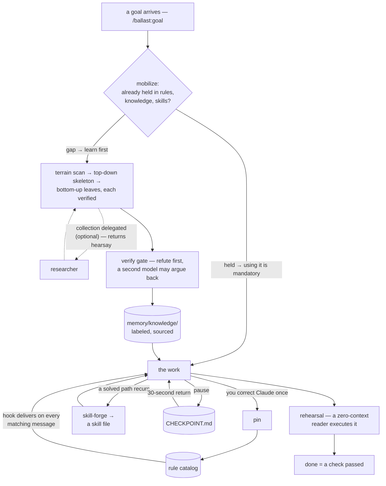

# ballast

**[한국어 문서 →](README.ko.md) · [简体中文 →](README.zh-CN.md)**


**ballast is a Claude Code plugin that takes a goal you have no expertise in, builds it up from the foundations, and carries it through — then keeps every solved path so the next goal starts further along.**

A few weeks into working with Claude, this piles up:

- **You give the same correction again next month**
- **A settled decision reopens, or quietly changes**
- **You act on an unsourced answer, and find out later**
- **Your copy names a feature nobody built yet**
- **"Done" turns out to mean Claude said so**
- **What you shipped stalls its first reader**
- **Another model's tidy summary lands as fact**
- **You re-research what the project already wrote down**

All eight have one cause: the weight sits in the conversation and nowhere else. Ships fix this by loading weight low in the hull, under everything else — that weight is called ballast. Here, it is rules, decisions, and verified facts riding in files, under the conversation.

And it accumulates. A method you only found after dead ends, a fact that survived checking, a vague problem finally cut into pieces — each one stays, and the next goal starts on top of it. You do not dig the same hole twice.

The smallest piece of that, live in a session — the first symptom on the list, with a rule you set once, weeks ago:

```
> add a setup script — npm install and we're done

[ballast] Standing rules that apply to this request:
- Use pnpm here: This repo uses pnpm. npm install has broken the
  lockfile twice; write scripts and commands with pnpm.

Claude: Using pnpm — your rule says npm broke the lockfile twice.
The setup script runs pnpm install.
```

The `[ballast]` block is the guaranteed part: "npm" matched your rule, so its full text arrived with this message. The reply line is illustrative — the hook guarantees delivery, not obedience.

## Install

```
/plugin marketplace add svy04/ballast
/plugin install ballast@ballast
```

Two lines in Claude Code and you are done. The hook runs on the `node` (≥ 18) already on your PATH; the other twelve pieces are markdown skills. (The install id reads `plugin@marketplace` — both happen to be named ballast here.)

Using Codex instead? The same repository installs as a Codex plugin — `codex plugin marketplace add svy04/ballast`, then `codex plugin add ballast@ballast` — and the same hook runs there: Codex loads `hooks/hooks.json` once you trust it in `/hooks`. Without the plugin, a project-level `.codex/hooks.json` does the same, and the bundled `codex exec` wrapper stays for builds without hooks: [docs/CODEX.md](docs/CODEX.md).

<p align="center">
  <a href="CHANGELOG.md"></a>
  <a href="LICENSE"></a>
</p>

<p align="center">
  <a href="#how-it-runs">How it runs</a> ·
  <a href="#the-pieces">Pieces</a> ·
  <a href="#quick-start">Quick start</a> ·
  <a href="#philosophy">Philosophy</a>
</p>

<details>
<summary><strong>Specs</strong> — dependencies, what is enforced, what ships empty</summary>

- **Zero dependencies, zero network** — the hook is one script, imports only `fs`/`os`/`path`; it reads local files and prints. ballast itself sends nothing anywhere (the optional verifier/researcher commands are local CLIs you configure, and the separate verify script only spawns `node` to re-run the hook)
- **One hook + twelve skills** — only the hook is code-enforced, and the docs label which is which
- **Ships empty, and says so** — every session opens with one line, `[ballast] hook live — N rules loaded`, zero at first; on messages the hook stays silent until a rule matches. [Quick start](#quick-start) is how rules get there. Standing cost: the twelve skill descriptions are about 490 words; skill bodies load only when a skill is invoked
- **[Hook verified on 10 cases](hooks/scripts/verify-hook.mjs)** — keyword inject, silence on no match, block, legacy input fields, broken catalog says so, broken catalog still never blocks, the manifest is in the shape Claude Code loads, and the session-start line appears with rules, without a catalog, and with a broken one. The harness checks what the hook emits, not whether the model obeys; run `node hooks/scripts/verify-hook.mjs` in a clone of this repo to re-check
- **MIT** — the whole mechanism is readable in an afternoon

</details>

## How it runs

Hand it something big — `/ballast:goal ship the pricing page` — and every piece attaches to that one goal, in order.

**It starts from what is already held.** At the session's first reply, the recall skill has swept the files brain-init scaffolded on day one: index, knowledge, decisions, rules, skills. All five, and it keeps going past the first hit. The goal skill then splits the objective into branches and judges each one against that inventory.

A covered branch must use its file. The pricing rule already in the catalog and the brand facts in `memory/knowledge/` come along as they are; nothing already held gets re-researched. A bare branch makes learning its first task.

**A bare branch starts with questions, not answers.** In a field you have never worked in, your sense of what matters is the least reliable thing you have. So the terrain scan collects what is argued, what is settled, and where beginners get burned, and lays them out as a map.

Then the branch is cut top-down into a pyramid of atomic pieces: no overlaps, nothing missing, each leaf small enough to verify on its own. A sub-field exposed mid-work is registered by name the moment it appears. Unfilled is allowed; unnamed is not.

**Leaves fill bottom-up, and nothing bears weight unverified.** Collection can be handed to a second CLI (researcher); its findings arrive `hearsay`, because it can fetch but it cannot rule. Every leaf faces the verify gate — refuted first, sourced, labeled — and what survives lands in `memory/knowledge/`.

The skeleton itself lives in `memory/goal/pricing-page.md`: the tree, its gaps, the next leaf. Tomorrow's session resumes from that file.

**The work runs on prepared ground.** Quality is set before the work, not patched after it. Mid-work you correct Claude once — "prices include VAT" — and pin writes that into the rule catalog; the hook delivers it with every message that matches, and only those. A standing rule rides along just when its keywords appear.

Anything said about the product outside the repo passes proof-standard first. External claims come from a truth file — a record of what verifiably works, evidence attached. No entry, no claim.

**Done is a claim, so done passes a check.** A zero-context reader walks the deliverable cold (rehearsal); the check passes when a round comes back stall-free, and that round's log is the evidence. A passed check is a file that exists, a test that runs, an output actually inspected.

What the goal solved then stays. Decisions go to the ledger, changed only by supersede — and only what the user actually said goes in; a reading of their silence stays in open questions. A procedure that will recur becomes a skill (skill-forge). A pause becomes a thirty-second return (checkpoint). Next quarter's pricing page opens on the solved path.

The same loop, drawn — boxes are pieces, cylinders are files that outlive the session:



Only the hook in all of this is code: a script that runs on every prompt, whether Claude cooperates or not. The twelve skills are conventions — markdown instructions that hold exactly as well as Claude follows them. Conventions drift: `CLAUDE.md` is read once and recedes as the work goes on, and a convention recedes the same way.

ballast does not pretend otherwise. Its route from convention to enforcement is **pin**: when a convention slips, you correct it once, pin writes the correction into the rule catalog, and the hook delivers it from then on.

## The pieces

| Piece | Kind | Role |
|---|---|---|
| **rules hook** | code — script on every prompt | Delivers each matching rule's full text with the message, up to a per-message cap fixed in the source (at most 12 rules / ~6,000 chars); `block` rules stop the prompt instead, showing your rule as the reason |
| **decision-ledger** | convention — markdown skill | Append-only `DECISIONS.md`; changed minds get supersede links, never silent edits; a non-answer is not a decision — readings the user never confirmed stay in open questions as `assumed` |
| **verify-gate** | convention — markdown skill | Research and model knowledge stay drafts until refuted-and-survived, sourced, and labeled |
| **knowledge-base** | convention — markdown skill | Gate-passed findings land in `memory/knowledge/`; every new question reads there before researching |
| **researcher** | convention — markdown skill | Hands collection to a configured second CLI — findings arrive `hearsay` and still face the gate |
| **proof-standard** | convention — markdown skill | No external claim without evidence in a truth file; copy may not blur code states |
| **brain-init** | convention — markdown skill | Scaffolds memory: index, ledger, open questions, session log, product truth; appends a session-start block to `CLAUDE.md` (on Codex, `AGENTS.md`) |
| **goal** | convention — markdown skill | Mobilizes what you already hold, maps the field, splits the goal top-down into a pyramid of atomic pieces — no overlaps, no gaps — and fills them bottom-up, each verified before it bears weight; the skeleton persists in `memory/goal/<slug>.md` |
| **rehearsal** | convention — markdown skill | A zero-context reader executes the deliverable before it ships; the round log becomes the done-check's evidence |
| **checkpoint** | convention — markdown skill | `CHECKPOINT.md` keeps a thirty-second return point; `HANDOFF.md` carries orders read once, then deleted |
| **pin** | convention — markdown skill | Turns the correction you just made into a permanent rule in the hook's catalog, in one step |
| **recall** | convention — markdown skill | At a session's first reply and at every subject shift, sweeps index, knowledge, decisions, rules, and skills before answering — and does not stop at the first hit |
| **skill-forge** | convention — markdown skill | A procedure that recurred and passed its check becomes a skill file; the next run starts from the solved path |

verify-gate's labels: `confirmed` / `observed` / `assumed` / `hearsay` / `unknown`. proof-standard tracks code in four states — implemented, wired, operational, verified.

Reference: [skills/](skills/) — each skill file's front matter says when it fires. Every skill is also callable as `/ballast:<name>`.

## Quick start

### First session

0. **Smoke-test in 60 seconds.** Create `<project>/.claude/ballast.rules.json` from the example catalog: [`rules/ballast.rules.example.json`](rules/ballast.rules.example.json). If you installed from the marketplace, ask Claude to copy the example catalog out of the ballast plugin, or paste the JSON from [Write the catalog by hand](#write-the-catalog-by-hand). Then send any message containing "generate": a `[ballast]` block above the reply means the hook is live.
1. **Pin your first rule.** Correct Claude about anything once — a correction is the **pin** skill's cue: Claude drafts the rule entry, shows it to you, and writes it to the catalog on your OK. If no draft appears, call `/ballast:pin` directly.
2. **`/ballast:brain-init`** scaffolds the memory files in your project — index, ledger, open questions, session log, product truth — and appends a session-start block to your `CLAUDE.md`, so expect that file to change.
3. **`/ballast:goal <something big>`** runs the full pipeline — in an unfamiliar field it maps the debates, the settled ground, and the beginner traps before producing a single answer.

Before any rule exists, your message arrives alone. With the example catalog from step 0 in place, "generate" trips its `cost-gate` rule and the message arrives like this:

```
> generate 40 images for the launch batch

[ballast] Standing rules that apply to this request:
- Estimate before spending: Anything that spends money or credits:
  present an estimate and get explicit approval BEFORE executing.
  No exceptions for small amounts — the habit is the point.
```

### Write the catalog by hand

Rules live in `<project>/.claude/ballast.rules.json` and `~/.claude/ballast.rules.json` (project wins on duplicate `id`). The `version`/`rules` wrapper is required — a file holding a bare rule object loads as zero rules, silently:

```json
{
  "version": 1,
  "rules": [
    {
      "id": "cost-gate",
      "title": "Estimate before spending",
      "when": { "keywords": ["generate", "credits"], "patterns": ["\\bbatch\\b"] },
      "action": "inject",
      "body": "Anything that spends money or credits: present an estimate and get explicit approval BEFORE executing. No exceptions for small amounts — the habit is the point."
    }
  ]
}
```

- `keywords` — case-insensitive substring match; the string must appear verbatim in the message, so add keywords in the language you chat in. Short keywords match inside longer words — `npm` also fires on `pnpm`
- `patterns` — regex match
- `always: true` — fires on every message; keep to 1–2 rules
- `action: "block"` — stops the prompt and shows `body` as the reason
- `BALLAST_DISABLE=1` — turns the hook off (set env vars in the environment you launch Claude Code from)
- `BALLAST_DEBUG=1` — prints load failures and bad patterns to stderr; the hook otherwise swallows them

Start from [`rules/ballast.rules.example.json`](rules/ballast.rules.example.json), or let **pin** write entries for you.

### Know the limits

Three design choices to keep in mind:

- **Fail-silent, with two exceptions** — a bad regex or an internal error never breaks your session and says nothing. The exceptions: a catalog that exists but will not parse gets one line back to you, because a dropped catalog otherwise looks exactly like a quiet one; and every session opens with one status line, because a dead hook otherwise looks exactly like a quiet one too.
- **Fail-open** — if the hook cannot run at all (`node` missing from PATH, catalog unreadable), `block` rules do not fire either. Treat blocks as a guardrail, not a sandbox.
- **Install changes one thing you can see** — the line at session start (`[ballast] hook live — no rule catalog yet`, until your catalog has a rule). Everything else waits for its cue: a correction cues pin, a session's first reply cues recall (which, before `/ballast:brain-init`, has no memory files to sweep). `BALLAST_DISABLE=1` turns the hook off, `BALLAST_QUIET=1` only the status line; the skills leave with the plugin. A project catalog travels with its repo: a cloned project's `.claude/ballast.rules.json` is someone else's standing instructions — the status line counts them, and how many are always-on, so read it when you open an unfamiliar repo.

Fail-open has no error screen — the symptoms are a missing `[ballast] hook live` line at session start and a missing `[ballast]` block on a message that should match. When you see either, check these three in order.

1. Check that `node --version` prints 18+ — install Node if it doesn't
2. Restart Claude Code if the plugin was installed this session
3. Rerun with `BALLAST_DEBUG=1` for the specific failure

Before a Claude-operated repo's first push, walk [docs/PUBLISH-CHECKLIST.md](docs/PUBLISH-CHECKLIST.md) — these workspaces accumulate secrets in files you stopped looking at.

<details>
<summary><b>Optional — put a second model on verification or collection duty</b></summary>

To put a second model on verification duty, create `<project>/.claude/ballast.verifier.json` — the whole file is `{ "command": "your-verifier-cli --check" }` ([example](rules/ballast.verifier.example.json)).

Point `command` at any CLI that will argue against a claim — the verify-gate skill runs it with the claim as the final argument and weighs the refutation before labeling anything `confirmed`. Without the file — or when the command fails, which gets reported once — the gate still runs on primary sources alone, labeled `(self-gated)`.

To delegate collection the same way, create `<project>/.claude/ballast.researcher.json` — same shape, `{ "command": "your-researcher-cli --search" }` ([example](rules/ballast.researcher.example.json)); the researcher skill runs it with the question as the final argument.

Collection is delegated, judgment is not: findings arrive `hearsay` and must still pass the gate. Without the file Claude collects as before; a failing command is reported once, then Claude collects directly.

</details>

## Philosophy

ballast starts from a plain situation: one person with no development background runs an entire job through Claude Code, across fields they were never trained in. What carries that is not knowing more up front — it is building up to each goal from the foundations that goal actually needs, and keeping every path already solved so the next goal starts further along.

What breaks it is memory and overconfidence. So rules live in files and arrive with the message that needs them.

Decisions live in a ledger that cannot be quietly rewritten. Claims carry labels until they earn `confirmed`.

The pieces share one arrangement: the check stands before the mistake. That order came from months of fixing accidents after they shipped — the same months the disclosure below files under `hearsay`. ballast is built to leave those accidents no room to happen.

By those labels, this README owes you two disclosures:

- **The track record is `hearsay`.** Those months of daily use happened in a private company workspace, and this public repo dates from August 2026 — there is no public history here to open.
- **The novelty claim is `unknown`.** Injecting context on prompt submit is a documented Claude Code hook pattern, and append-only records long predate software. "We have not seen the whole loop elsewhere" is the most ballast can say.

What you can check is the mechanism: the hook, the twelve skills, and the rule format are all in this repo. If you know prior art for the loop, [open an issue](https://github.com/svy04/ballast/issues) and we'll link it.

## Maintenance

Version history lives in [CHANGELOG.md](CHANGELOG.md) — each release records what changed and what was corrected. Ask anything in [an issue](https://github.com/svy04/ballast/issues); answers that belonged in this README get written into it.

Pull requests start at [CONTRIBUTING.md](CONTRIBUTING.md) — the short version: the hook stays zero-dependency and fail-silent, and docs must match behavior.

---

MIT
