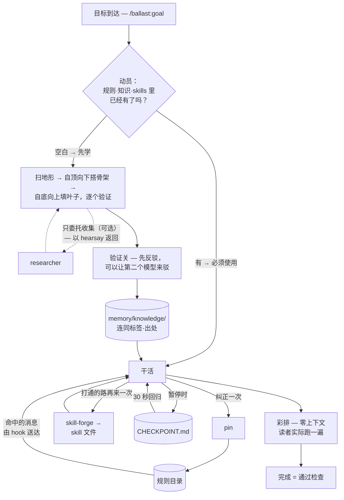

# ballast

**[English →](README.md) · [한국어 →](README.ko.md)**

> 中文文档可能更新滞后，如有出入以英文文档为准。


**ballast 是一个 Claude Code 插件：接住一个你毫无经验的领域的目标，从地基开始一层层搭到完成 — 再把打通的每条路留下来，让下一个目标从更前面出发。**

和 Claude 一起工作几周后，这些事会越积越多：

- **同一个纠正，下个月又要再说一遍** — 命中的消息会连同那条规则一起送达
- **定过的决定被重新打开，或者悄悄变了** — 决定只追加、不覆盖
- **信了一个没有出处的回答，事后才发现** — 主张要先扛住反驳才算事实
- **文案写了一个还没做出来的功能** — 对外的话只写有证据的
- **"做完了"的依据只有 Claude 自己的话** — 通过检查才叫完成
- **交付物在第一个读者手里就卡住了** — 先让一个什么都不知道的人实际跑一遍
- **另一个 AI 整理的摘要直接落地成了事实** — 收集可以委托，采不采信不委托
- **已经记下来的东西找不到，又去查了一遍** — 回答之前先把手里的全部翻一遍

这八行的病因只有一个：所有的分量都只压在对话里。船解决这个问题的办法，是把重物压进舱底、压在一切之下 — 那份重量叫 ballast（压舱物）。在这里，压舱物就是规则、决定和验证过的事实 — 装进文件，垫在对话之下。

而且压舱物会累积。摸索半天才找到的方法、通过验证的事实、把庞大模糊的问题拆细后的结果 — 都会原样留下，下一个目标从它们之上出发。同一条路不挖第二遍。

清单第一行实际是怎么被拦住的，给你看一段。假设几周前埋过一条规则：

```
> 帮我写个安装脚本 — npm install 一下就行

[ballast] Standing rules that apply to this request:
- 只用 pnpm：这个仓库只认 pnpm。npm install 已经弄坏过
  两次锁文件 — 脚本和命令一律走 pnpm。

Claude: 那我走 pnpm — 有条规则在提醒 npm 弄坏过两次锁文件。
安装脚本我用 pnpm install 写好了。
```

`[ballast]` 那一块就是 ballast 保证的部分。"npm" 命中了规则，整段规则原文随这条消息一起送达；下面的回答不是 Claude 记性好，而是它照着递到眼前的规则做了。

## 安装

```
/plugin marketplace add svy04/ballast
/plugin install ballast@ballast
```

在 Claude Code 里这两行就装完了。hook 用 PATH 里已有的 `node`（18+）运行，其余全部是 markdown。（安装命令的格式是 `插件名@市场名`，这里两个名字恰好都叫 ballast，所以出现了两次。）

用 Codex 的话 — 那边没有插件市场，一次简短的手动设置（clone + 一段 `AGENTS.md` + 示例规则目录）就能把十二个 skills 原样搬过去：[docs/CODEX.md](docs/CODEX.md)（英文）。交互式 Codex 会话靠约定运行，而 `codex exec` 路径可以通过随附的 wrapper 获得真实的规则送达（见同一文档）。

<p align="center">
  <a href="CHANGELOG.md"></a>
  <a href="LICENSE"></a>
</p>

<details>
<summary><strong>规格</strong> — 依赖、强制范围、出厂为空</summary>

- **零依赖、零网络** — hook 是一个脚本，import 只有 `fs`/`os`/`path`。ballast 本身不向外发送任何东西（可选接入的 verifier/researcher 命令是你自己挑的本地 CLI；检查用的 harness 是独立脚本，只是再起一个 `node` 把 hook 重跑一遍）
- **1 个 hook + 12 个 skills** — 代码强制的只有 hook 一个，哪块是代码、哪块是约定，表里全部写明
- **出厂为空** — 规则目录（存规则的文件）里没有规则之前，hook 保持沉默。怎么放进第一条见[快速开始](#快速开始)
- **[hook 实测 6 个用例通过](hooks/scripts/verify-hook.mjs)** — 关键词注入 · 未命中沉默 · 拦截 · 旧字段兼容 · 目录损坏会说明 · 但绝不卡死会话；clone 仓库后 `node hooks/scripts/verify-hook.mjs` 可以自己复验
- **MIT** — 整套机制一个下午就能读完

</details>

## 为什么是 ballast

### 处方

首屏那八行为什么会发生、哪个部件负责治，对照如下。*代码* 表示由脚本强制执行；*约定* 表示 Claude 承诺遵守的 markdown 指令。

| 为什么会这样 | 负责的部件 |
|---|---|
| `CLAUDE.md` 只在开头被读一次 — 工作越往后越远 | **rules hook** *(代码)* — 命中的规则原文随每条消息送达 |
| 决定埋在过去的对话里 | **decision ledger**（决策台账）*(约定)* — 只追加，推翻用替代（supersede）记录 |
| 说得通的句子慢慢变成了事实 | **verify gate**（验证关）*(约定)* — 每个主张挂标签，`confirmed`（已确认）要挣来 |
| 文案描述的是路线图而不是产品 | **proof standard**（证据标准）*(约定)* — 对外主张只能出自真实档案 |
| "完成"的依据只有 Claude 的话 | **goal** *(约定)* — 完成 = 通过检查 |
| 交付物见到读者的瞬间垮掉 | **rehearsal**（彩排）*(约定)* — 零上下文读者在交付前实际跑一遍 |
| 收集和采信绑在一起动 | **researcher** *(约定)* — 收集可以委托、采信不委托，结果一律以 `hearsay` 到达 |
| 记下来的东西连索引都有，却没被翻开 | **recall**（全量翻查）*(约定)* — 会话首答和话题切换时，回答前把五处全部翻一遍 |

真实档案（`memory/PRODUCT-TRUTH.md`）是把产品实际做到的事，连同证据和日期记下来的文件。"通过检查"的意思是：文件在、测试跑过、产出物亲眼看过。

八行里由代码强制的只有一行。rules hook 是每个 prompt 都会执行的脚本，Claude 配不配合它都会触发。

其余七行是约定 — Claude 遵守多少就保住多少，和任何提示词一样可能漂移。ballast 不装作不是这样。

而把约定强行拉回来的通道是 **pin**。哪条约定滑了，你纠正一次 — pin 把这次纠正写进规则目录，之后由 hook 负责送达。

### 链条

这些部件还会沿着一个目标的生命周期连成链 — 链上代码只有 hook 一个，其余全是约定：

- **准备** — recall 在会话首答和话题切换时把手里的全部翻一遍，goal 把翻到的拉进任务里用，再扫一遍地形 — 接了 researcher 的话，收集本身也可以委托出去
- **积累** — 干活过程中验证过的东西，存进 knowledge-base（知识库）和决策台账
- **复用·复制** — rules hook · pin · skill-forge（技能锻造）把积累的东西还给下一个会话、下一个目标
- **质量保障** — verify-gate 站在主张和 `confirmed` 之间，彩排站在交付物和读者之间，goal 在检查通过之前不说完成

checkpoint（回归点）负责在你休息时接住这条链 — 回到目标只要读 30 秒。同一条链画成一个目标走过的路径是下图。方块是部件，圆柱是会话结束后仍留存的文件。



## 会有什么不同

| 之前 | 之后 |
|---|---|
| 同一个纠正每周重复 | **pin** 写一次，命中的消息都会带着它到 |
| 常驻规则和当前话题无关也占上下文 | 只送命中的规则 — 上限 12 条 · 约 6,000 字符 |
| 本该拦下的 prompt 直接通过了 | `action: "block"` 会拒绝，并把那条规则当理由亮出来 |
| 换个会话记忆就清零 | `memory/` 文件留着：索引、台账、未决问题、会话日志 |
| 目标的骨架随会话蒸发 | `memory/goal/<slug>.md` 保住树、空白、下一片叶子 |

送达上限是写死在 hook 源码里的值。拦截是护栏不是沙箱 — hook 跑不起来时拦截也一起失效（fail-open，详见[快速开始](#快速开始)）。

到这里是唯一由代码强制的部件做的事。十三个部件全部贴上标签是这样。

## 部件清单

| 部件 | 类型 | 职责 |
|---|---|---|
| **rules hook** | 代码 — 每个 prompt 运行的脚本 | 把命中的规则原文（到上限为止）随消息送达，`block` 规则会拦停 prompt |
| **decision-ledger** | 约定 — markdown skill | 只追加的 `DECISIONS.md` — 推翻用替代链接，不存在悄悄修改 |
| **verify-gate** | 约定 — markdown skill | 扛住反驳、给出出处之前，调研结果和模型知识一律按草稿对待 |
| **knowledge-base** | 约定 — markdown skill | 过了关的发现存进 `memory/knowledge/` — 新问题先看这里再去调研 |
| **researcher** | 约定 — markdown skill | 把收集交给接入的第二个 CLI — 结果以 `hearsay` 到达，仍要过关 |
| **proof-standard** | 约定 — markdown skill | 真实档案里没有证据就不许对外主张 — 文案不能糊化代码的真实状态 |
| **brain-init** | 约定 — markdown skill | 铺好记忆骨架：索引、台账、未决问题、会话日志、产品真实 — 会话启动块贴进 `CLAUDE.md`（Codex 则是 `AGENTS.md`） |
| **goal** | 约定 — markdown skill | 先动员已有的，再把目标自顶向下拆成不重不漏的原子金字塔，空白自底向上边验证边填 |
| **rehearsal** | 约定 — markdown skill | 交付前由零上下文读者实际跑一遍 — 卡住的记录就是完成判定的证据 |
| **checkpoint** | 约定 — markdown skill | `CHECKPOINT.md` 保住 30 秒回归点 — `HANDOFF.md`（给下个会话的一次性指令）读完即删 |
| **pin** | 约定 — 写 hook 要强制的规则 | 把刚收到的纠正一次变成永久规则 |
| **recall** | 约定 — markdown skill | 会话首答和话题切换的瞬间，回答前把索引·知识·决定·规则·skills 五处翻一遍 — 不在第一个命中就停手 |
| **skill-forge** | 约定 — markdown skill | 把还会再来、且通过了检查的流程锻成 skill 文件 — 下次从打通的路上出发 |

verify-gate 的标签有五种：`confirmed` / `observed`（观察到）/ `assumed`（假定）/ `hearsay`（传闻）/ `unknown`（未知）。proof-standard 用四个状态追踪代码：已实现 · 已接通 · 可运行 · 已验证。

参考：[skills/](skills/) — 每个 skill 文件开头写着它何时触发。所有 skill 也都能用 `/ballast:<名字>` 直接调用。

十三个部件按顺序扣在同一个目标上。完整一圈是这样。

## 一个目标，从头到尾

1. `/ballast:goal 做一个定价页` — 动员先找出规则目录里的定价规则和 `memory/knowledge/` 里的品牌事实。两样都不再调研，直接用。
2. 有一块（支付文案的惯例）是空白。扫一遍地形，把目标自顶向下拆到原子，空白自底向上填 — 接了 researcher 就把收集委托出去（全部以 `hearsay` 返回），只有过了关的才进 `memory/knowledge/`。
   骨架留在 `memory/goal/pricing-page.md`，明天的会话从同一棵树接着来。
3. 干活时纠正了一次 — "价格一律含税"。pin 写进规则目录，之后只要聊到价格，hook 就会送达。
4. "页面上线了、表单测过了"仍然只是主张。零上下文读者从头把页面走一遍（彩排），无卡点通过的那份记录才构成完成。
5. 今天到此为止 — checkpoint 记下 30 秒回归点。明天不是从"上次做到哪了"开始，而是从*下一个动作*开始。
6. 下个季度的定价页从打通的路上出发 — skill-forge 已经把这套流程留成了 skill。

一次纠正、一条验证过的事实、一套打通的流程 — 全都活得比会话长。这个插件的全部就是这句话。

不过这六步要等规则目录里至少有一条规则才转得起来。种下那一条，就是快速开始。

## 快速开始

### 第一个会话

0. **60 秒冒烟测试。** 把 `<项目>/.claude/ballast.rules.json` 建成示例目录（[`rules/ballast.rules.example.json`](rules/ballast.rules.example.json)）。
   通过市场装的话，直接对 Claude 说"把 ballast 插件的示例规则目录复制过来"，或者把下面[自己写规则目录](#自己写规则目录)的 JSON 粘进去。
   然后随便发一条含 "generate/生成" 的消息 — 回答上方出现 `[ballast]` 块，hook 就是活的。
1. **种下第一条规则。** 在任何工作里纠正 Claude 一次 — 纠正本身就是 **pin** 的信号，Claude 会给出规则草稿，你说 OK 它就写进目录。草稿没弹出来就直接 `/ballast:pin`。
2. **`/ballast:brain-init`** — 给项目铺好记忆文件的骨架。同时会在 `CLAUDE.md` 里追加会话启动块 — 那个文件被改动是正常的。
3. **`/ballast:goal <一个大目标>`** — 跑完整条流水线。要是陌生领域，会先把争议点 · 定论 · 新手陷阱画成地图，再开始给答案。

规则目录为空时消息上什么都不会附加。第 0 步的示例目录铺好后，"生成"会命中 `cost-gate` 规则，消息就这样到达：

```
> 帮我生成 40 张图

[ballast] Standing rules that apply to this request:
- Estimate before spending: Anything that spends money or credits:
  present an estimate and get explicit approval BEFORE executing.
  No exceptions for small amounts — the habit is the point.
```

### 自己写规则目录

规则放在 `<项目>/.claude/ballast.rules.json` 和 `~/.claude/ballast.rules.json`（`id` 重复时项目侧优先）。`version`/`rules` 这层外壳是文件格式的一部分 — 只存规则对象会被静默读成 0 条规则：

```json
{
  "version": 1,
  "rules": [
    {
      "id": "cost-gate",
      "title": "Estimate before spending",
      "when": { "keywords": ["generate", "生成", "credits", "积分"], "patterns": ["\\bbatch\\b"] },
      "action": "inject",
      "body": "Anything that spends money or credits: present an estimate and get explicit approval BEFORE executing. No exceptions for small amounts — the habit is the point."
    }
  ]
}
```

- `keywords` — 不分大小写的子串匹配。消息里必须原样含有那个字符串才命中 — 用中文对话就像上面那样把中文关键词并排写上。短关键词在长单词里也会命中 — `npm` 也会被 `pnpm` 触发
- `patterns` — 正则
- `always: true` — 每条消息都触发，省着用，1~2 条为宜
- `action: "block"` — 拦停 prompt，把 `body` 作为理由亮出来
- `BALLAST_DISABLE=1` — 关闭 hook（环境变量设在启动 Claude Code 的环境里）
- `BALLAST_DEBUG=1` — 把目录加载失败、写坏的正则打到 stderr。平时 hook 吞掉并保持安静

起步可以直接复制 [`rules/ballast.rules.example.json`](rules/ballast.rules.example.json)，或者交给 **pin**。

### 了解边界再用

设计上有两件事要先知道：

- **静默失败，只有一个例外** — 正则写错、内部出错，会话都不会崩、也不会说话。例外是目录存在却读不出来 — 只有这时会提示一行。不然"规则整包丢失"和"只是没命中"看起来一模一样。
- **fail-open** — hook 完全跑不起来时（PATH 里没有 `node`、目录读取失败），`block` 规则也一起失效。拦截当护栏用，不要当成攻不破的沙箱。

fail-open 没有报错界面 — 唯一的症状是本该命中的消息上没有出现 `[ballast]` 块。看到这个症状就按顺序查三样：

1. 确认 `node --version` 是 18+ — 没有就先装 Node
2. 刚装好插件的话，重启 Claude Code
3. 用 `BALLAST_DEBUG=1` 再跑一次看原因

确认 hook 活过来之后，第一次 push 之前还有一件事。由 Claude 长期驱动的仓库，请按 [docs/PUBLISH-CHECKLIST.md](docs/PUBLISH-CHECKLIST.md)（英文）逐行过一遍 — 这类工作区里，不知不觉没人再翻的文件里会积攒秘密值。

<details>
<summary><b>可选 — 给验证·收集接上第二个模型</b></summary>

想让第二个模型参与验证，就建 `<项目>/.claude/ballast.verifier.json` — 整个文件就一行 `{ "command": "your-verifier-cli --check" }`（[示例](rules/ballast.verifier.example.json)）。

`command` 指向一个能反驳主张的 CLI 后，verify-gate skill 会把主张接在最后一个参数上执行，比对反驳之后才给 `confirmed`。

文件不存在或命令挂了（说一次），验证关就只靠亲自打开的一手出处运转，并在标签旁并记 `(self-gated)`。

收集同理 — 在 `<项目>/.claude/ballast.researcher.json` 里放 `{ "command": "your-researcher-cli --search" }`（[示例](rules/ballast.researcher.example.json)）。
researcher skill 会把问题接在最后一个参数上执行。

收集可以委托，采信不委托 — 结果以 `hearsay` 到达，必须过关。文件不存在就照现在这样由 Claude 亲自收集；命令挂了就说一次，然后转回亲自收集。

</details>

## 哲学

ballast 的出发点很平常。一个没有开发背景的人，在一个个没学过的领域之间穿梭，把全部工作压在 Claude Code 上跑。撑住这一切的不是提前懂得更多，而是每个目标都从它需要的地基开始搭，并把打通的路留下来，让下一个目标从更前面出发。

而摧毁这一切的是记忆和过度自信。所以规则放进文件，随需要它的那条消息一起到达。

决定留在无法悄悄改写的台账上。主张在挣到 `confirmed` 之前一直挂着标签。

部件的排布原理只有一条 — 检查跑在事故前面。规则先于回答到达，动员（先掏出已有的）先于干活运转，彩排先于读者见到交付物。

这个顺序来自"事故发布之后再修"的那几个月 — 就是下面用 `hearsay` 标明的那几个月。ballast 的构造是为了收窄同类事故发生的空间。

按同一套标签标准，这份 README 有两件事要说清：

- **实绩是 `hearsay`。** 那几个月的日常使用发生在不公开的公司工作区里，这个公开仓库始于 2026 年 8 月 — 这里没有可以翻看的历史。
- **新颖性主张是 `unknown`。** prompt 提交时注入上下文是有文档的 Claude Code hook 模式，只追加的记录比软件本身还古老。ballast 能说的最大限度是"没在别处见过把整条闭环捆在一起的"。

但机制本身可以核查 — hook、十二个 skills、规则格式全在这个仓库里，一个下午就能读完。知道这条闭环的先例的话，请开 [issue](https://github.com/svy04/ballast/issues) 告诉我们，我们会链接上去。

## 维护

版本历史在 [CHANGELOG.md](CHANGELOG.md)（英文）— 每个版本改了什么、纠正了什么都有记录。有问题开 [issue](https://github.com/svy04/ballast/issues)，答案会回填进文档 — 本该写在 README 里的答案就写回 README。

PR 从 [CONTRIBUTING.md](CONTRIBUTING.md)（英文）出发 — 要点两行：hook 保持零依赖和静默失败，文档不得与实际行为不符。

---

MIT